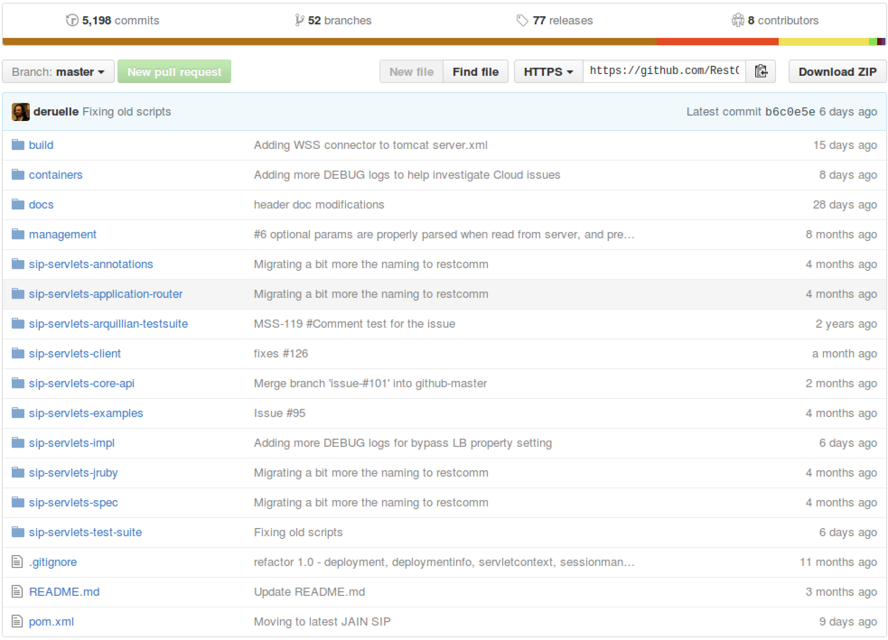
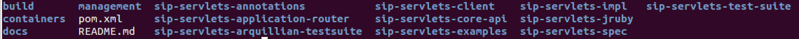

[[build-from-source]]
= How to build Restcomm-Connect/sip-servlets from source (updated on 18/05/2016)

== Requirements

* You must have link:https://git-scm.com/book/en/v2/Getting-Started-Installing-Git[git] installed on your computer
* You must have link:http://ant.apache.org/manual/install.html[ant] installed on your computer
* You must have link:http://www.oracle.com/technetwork/java/javase/downloads/jdk7-downloads-1880260.html[JDK - 7] installed on your computer
* You must be running link:https://maven.apache.org/download.cgi[maven] version 3.x.x on your computer

== Obtaining git URL

* Go to  https://github.com/RestComm/sip-servlets.git[sip-servlets git]. You will see the page like this one below. Copy the URL in the *HTTPS* field.
The URL should look like this: https://github.com/RestComm/sip-servlets.git

== Restcomm-Connect/sip-servlets cloning

In the bash window of your local computer create a directory where you should clone Restcomm-Connect/sip-servlets:

* Run the command :

[source,bash]
----
git clone https://github.com/RestComm/sip-servlets.git
----
* This command will create a new directory called sip-servlets. Go to this directory by entering the command:

[source,bash]
----
 cd sip-servlets
----

The content of the directory should contain the following:

== Restcomm-Connect/sip-servlets building

* From sip-servlets folder, go to release folder by etering the command:

[source,bash]
----
 cd ./build/release
----
* At this folder, *build.xml* is the file shall be used by ant application to build sip-servlets source code. To build this source, entering the command:
[source,bash]
----
 ant -buildfile ./build.xml
----
This may take a while to build. If the build is successful, you should see this output at the end of the build:
[source,bash]
----
release:

BUILD SUCCESSFUL
Total time: 42 minutes 11 seconds
----

== Start Restcomm-Connect/sip-servlets
* At this tutorial, we will use tomcat-8 for running application. From .../sip-servlets/build/release, go to tomcat-8 bin folder by command:
[source,bash]
----
 cd ./target/apache-tomcat-8.0.26/bin
----
* Change permisson:
[source,bash]
----
 sudo chmod +x catalina.sh
----
* Start server:
[source,bash]
----
 ./catalina.sh run
----
You need to wait until terminal prints out below info
[source,bash]
----
 May 19, 2016 7:19:18 AM org.apache.catalina.startup.Catalina start
 INFO: Server startup in 4751 ms
----
For more infomation, you can read at http://documentation.telestax.com/core/sip_servlets/SIP_Servlets_Server_User_Guide.html#_getting_started_with_mss_tomcat_as7[Restcomm-Connect starting with as7 2.2]

== Stop Restcomm-Connect/sip-servlets
To stop Restcomm-Connect/sip-servlets, on terminal where Restcomm-Connect/sip-servlets was started, press Ctrl+C.

== Restcomm-Connect/sip-servlets testing, sending traffic
Please refer http://documentation.telestax.com/core/sip_servlets/SIP_Servlets_Server_User_Guide.html#_getting_started_with_mss_tomcat_as7[Restcomm-Connect starting with as7 2.2.1]

== Restcomm-Connect/sip-servlets IP Address configuration
At default 127.0.0.1 is the ip address of server. If you want to change the IPAddress of the server, From .../sip-servlets/build/release, go to tomcat-8 conf folder by command:
[source,bash]
----
 cd ./target/apache-tomcat-8.0.26/conf/
----
Open *server.xml* file, replace all "127.0.0.1" to "one of ipaddresses which your machine has". For example, if machine has interface: eth0 ip 192.168.1.7, please replace "127.0.0.1" by "192.168.1.7". You also can change the port of server in this file.

*  On Linux, entering command:
[source,bash]
----
 vi server.xml
 
 :%s/127.0.0.1/192.168.1.7/g
----
The output should be like down below:
[source,bash]
----
    <!-- Define an AJP 1.3 Connector on port 8009 -->
    <Connector port="8009" protocol="AJP/1.3" redirectPort="8443" />

    <!-- Define a SIP Connector on port 5080 -->
    <Connector port="5080" 
        ipAddress = "192.168.1.7"
        protocol="org.mobicents.servlet.sip.startup.SipProtocolHandler"
        signalingTransport="udp"/>

        <!-- Define the default TCP SIP Connector -->
    <Connector port="5080" 
             ipAddress = "192.168.1.7"
             protocol="org.mobicents.servlet.sip.startup.SipProtocolHandler"
             signalingTransport="tcp"/>

    <!-- Define the default TLS SIP Connector -->
    <Connector port="5081" 
             ipAddress = "192.168.1.7"
             protocol="org.mobicents.servlet.sip.startup.SipProtocolHandler"
             signalingTransport="tls"/>

    <!-- Define the default SIP Over WebSockets Connector -->
    <Connector port="5082" 
             ipAddress = "192.168.1.7"
             protocol="org.mobicents.servlet.sip.startup.SipProtocolHandler"
             signalingTransport="ws"/>

    <!-- Define the default Secure SIP Over WebSockets Connector -->
    <Connector port="5083" 
             ipAddress = "192.168.1.7"
             protocol="org.mobicents.servlet.sip.startup.SipProtocolHandler"
             signalingTransport="wss"/>
----

== Restcomm-Connect/sip-servlets logs configuration, logs collection
For getting logs to debug or tracing flow of the code, you can enable a lot of log levels: INFO, WARNING, DEBUG ..etc.

*  From .../sip-servlets/build/release, go to tomcat-8 lib folder by commnad:
[source,bash]
----
 cd ./target/apache-tomcat-8.0.26/lib
----
At default, the printout from sip-servlets application is at INFO level. To get more information from the source, adding more log level to configuration file named log4j.xml
  
Original content:
[source,bash]
----
  <category name="org.mobicents">
     <priority value="INFO" />
   </category>
   <category name="gov.nist">
     <priority value="INFO" />
   </category>

  <root>
    <priority value ="INFO" />
    <appender-ref ref="rolling-file" />
    <appender-ref ref="console" />
  </root>
----
Changed Content:
[source,bash]
----
  <category name="org.mobicents">
     <priority value="INFO,DEBUG" />
   </category>
   <category name="gov.nist">
     <priority value="INFO,DEBUG" />
   </category>

  <root>
    <priority value ="INFO,DEBUG" />
    <appender-ref ref="rolling-file" />
    <appender-ref ref="console" />
  </root>
----
== Restcomm-Connect/sip-servlets
*Thanks for reading*
