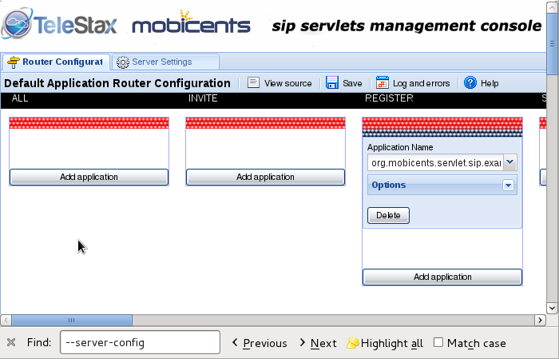
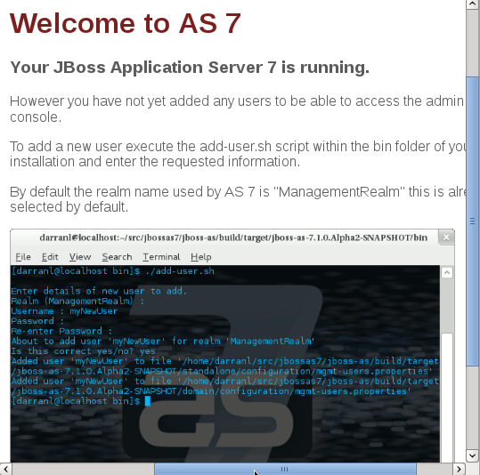

[[_getting_started_with_mss_jboss_as7]]
= Getting Started with Restcomm for JBoss AS7 

.Features not yet available on Restcomm for JBoss AS7 
[NOTE]
====
* SIP Failover  

* SNMP  

* Jopr Monitoring  
====

Some of the features mentioned above will likely be added in the future.
As of the time of this writing, they are not available.
Even though Jopr monitoring is not available, there is a Command Line Interface (CLI), which will be discussed further down.
As the features become available, this guide will be updated to reflect the changes.
 

== Downloading and Starting Restcomm SIP Servlets for JBoss AS7

If you have been working with JBoss for some time, you will quickly notice that the JBoss AS7 iteration has gone through a lot of changes.
This guide will help you understand how you can quickly get started with JBoss AS7 within the Restcomm framework. 

You can go to the link below to download the latest Restcomm SIP Servlets for JBoss AS7: link: https://github.com/RestComm/sip-servlets/releases/latest[Download Latest Version of Restcomm SIP Servlets for JBoss AS7 ]

You will need to extract the content of the file into a directory on your local system.
The root directory of the Restcomm SIP Servlets for JBoss AS7 that you downloaded will be referred to in this guide as $JBOSS_HOME.
 

If this is your first time working with Restcomm SIP Servlets for JBoss, you will need to make sure you have Java Run Time or JDK installed on your computer.
You will also need to have the environment variables set.

. Starting Restcomm SIP Servlets for JBoss AS7 
To start the server do the following:

----

$JBOSS_HOME/bin/standalone.sh
----

During the startup process, you will notice that the final part of the log output will be similar to the truncated output below.
Notice that the Admin Console interface can be accessed at `http\://172.0.0.1:9990`.
This will be explained later.
 

----

14:28:43,972 INFO  [org.jboss.as] (Controller Boot Thread) JBAS015951: Admin console listening on http://127.0.0.1:9990
14:28:43,974 INFO  [org.jboss.as] (Controller Boot Thread) JBAS015874: JBoss AS 7.1.2.Final "Steropes" 
started in 22148ms - Started 222 of 306 services (83 services are passive or on-demand)
----

You will notice that the startup is very fast.
The reason for this is that JBoss was rewritten from the ground up for speed with services being started concurrently and non critical services remain passive until first use.
This provides better system resource management.
With the simple startup above, you will be able to enter the default web interface of the application server by going to this url 'http\://127.0.0.1:8080'.
The result will show a screenshot similar to the one below. 

.JBoss Application Server 7 Welcome Page
image::images/welcome-page-Mss-JBoss-AS7.png[]

With the standard startup script, you will not have access to any SIP functionalities.
This is because of the modular approach implemented in JBoss AS7.
There is a configuration file that needs to be used to activate additional functionalities like SIP and High Availability. 

In order to start the Restcomm SIP Servlets for JBoss AS7 with SIP functionalities, you need to append the startup script with the SIP configuration file.
The configuration files are located in the $JBOSS_HOME/standalone/configuration directory.
You can see the content of the directory below 

----

application-roles.properties  mgmt-users.properties     standalone-ha.xml
application-users.properties  mss-sip-stack.properties  standalone-sip.xml
dars                          standalone-full-ha.xml    standalone.xml
logging.properties            standalone-full.xml       standalone_xml_history
----

.Starting Restcomm SIP Servlets for JBoss AS7 with SIP
If you want to start Restcomm SIP Servlets with SIP services activated, you need to go to the $JBOSS_HOME/bin directory.
Type the following command: 

----

./standalone.sh -c standalone-sip.xml
----

. You will see a message similar to the one below once the server is successfully started
----

20:43:21,487 INFO  [org.jboss.as.server] (ServerService Thread Pool -- 37) JBAS018559: Deployed "click2call.war"
20:43:21,489 INFO  [org.jboss.as.server] (ServerService Thread Pool -- 37) JBAS018559: Deployed "sip-servlets-management.war"
20:43:21,647 INFO  [org.jboss.as] (Controller Boot Thread) JBAS015951: Admin console listening on http://127.0.0.1:9990
20:43:21,648 INFO  [org.jboss.as] (Controller Boot Thread) JBAS015874: JBoss AS 7.1.2.Final "Steropes" started in 26560ms - Started 232 of 321 services (88 services are passive or on-demand)
----

The click2call SIP sample application bundled with Restcomm SIP Servlets will become available at this url `http\://127.0.0.1:8080/click2call`.
You can configure multiple SIP softphones to use the sample application.
See the section below for how to configure and test the SIP sample application. 

== Testing Click2Call with Restcomm SIP Servlets for JBOSS AS7 

Once the server is started as stated in the previous section, you can configure multiple instances of any SIP softphone you prefer.
In this example, Linphone will be used. 

----

(configuring two instances of Linphone)

start Linphone 
go to the Options menu

On the Network Settings tab, 
	SIP (UDP) port to 5061. (leave the rest as default)
On the Manage SIP Accounts tab, 
	click the add button
	Your SIP identity: = sip:linphone@127.0.0.1:5080
	SIP Proxy address: = sip 127.0.0.1:5080

Leave the rest of the settings as default.
	

Configuring Linphone (on the second shell)

go to the Options menu

On the Network Settings tab, 
	SIP (UDP) port to 5062. (leave the rest as default)
On the Manage SIP Accounts tab, 
	click the add button
	Your SIP identity: = sip:linphone2@127.0.0.1:5080
	SIP Proxy address: = sip 127.0.0.1:5080

Leave the rest of the settings as default.
----

A correctly configured Linphone will look like the screenshot below. 

.Successfully Configured Linphone
image::images/linphone-registration-port-5080.png[]

Once the phones are successfully registered with the Restcomm SIP Servlets for JBoss AS7 server, you can check the result in the sample SIP application at this url, `http\://127.0.0.1:8080/click2call`

.Click2call SIP Registered Softphones
image::images/click2call-JbossAS7-registered-clients.png[]

You can make calls from the sample click2call application and see the logs in the shell terminal you used to start the Restcomm SIP Servlets for JBoss AS7 server.
 
[[_getting_started_with_mss_jboss_as7_cli]]
==  Command Line Interface for Restcomm SIP Servlets JBoss AS7

Part of the task of any administrator who has to manage a JBoss server will be to monitor services offered to clients.
There is a command line interface bundled with JBoss AS7 which can be accessed by going to the $JBOSS_HOME/bin directory.
 

You need to make sure that the JBoss server is running on your system and listening on port 9999.
The section below will work you through steps to familiarize yourself with the CLI.
 

There are so many features available with the Restcomm SIP Servlets for JBoss AS7 CLI.
The example below will concentrate on getting data from the SIP you started using the [path]_ ./standalone.sh -c standalone-sip.xml _ script.
 

In the $JBOSS_HOME/bin directory, type  

----

./jboss-cli.sh
----

(This will show the message below) 

----

You are disconnected at the moment. 
Type 'connect' to connect to the server or 
'help' for the list of supported commands.
----

At the [disconnected /] command  prompt, type  

----

connect
----

When you see the [standalone@localhost:9999 /] at the prompt, you are successfully connected to the server. 

.Navigating the CLI 
[NOTE]
====
Moving around the Restcomm SIP Servlets for JBoss AS7 CLI is similar to normal file system with a few exceptions.
You can use commands like, (ls, cd, cd..) to navigate around the CLI 
====

Follow the steps below to access SIP information from the CLI 

----

At the prompt type (ls)

[standalone@localhost:9999 /] ls
core-service                  deployment                    extension
interface                     path                          socket-binding-group
subsystem                     system-property               launch-type=STANDALONE
management-major-version=1    management-minor-version=2    name=linux-fedora
namespaces=[]                 process-type=Server           product-name=undefined
product-version=undefined     profile-name=undefined        release-codename=Steropes
release-version=7.1.2.Final   running-mode=NORMAL           schema-locations=[]
server-state=running

[standalone@localhost:9999 /] cd deployment

[standalone@localhost:9999 deployment] ls
click2call.war                sip-servlets-management.war

[standalone@localhost:9999 deployment] cd click2call.war

[standalone@localhost:9999 deployment=click2call.war] ls
subdeployment
subsystem
content=[{"path" => "deployments/click2call.war","relative-to" => "jboss.server.base.dir","archive" => true}]
enabled=true
name=click2call.war
persistent=false
runtime-name=click2call.war
status=OK

[standalone@localhost:9999 deployment=click2call.war] cd subsystem 

[standalone@localhost:9999 subsystem] ls
sip   web

[standalone@localhost:9999 subsystem] cd sip

[standalone@localhost:9999 subsystem=sip] ls
servlet
active-sip-application-sessions=7
active-sip-sessions=8
app-name=org.mobicents.servlet.sip.example.SimpleApplication
expired-sip-application-sessions=25
expired-sip-sessions=26
max-active-sip-sessions=-1
rejected-sip-application-sessions=0
rejected-sip-sessions=0
sip-application-session-avg-alive-time=180
sip-application-session-max-alive-time=230
sip-application-sessions-created=32
sip-application-sessions-per-sec=0.0
sip-session-avg-alive-time=162
sip-session-max-alive-time=180
sip-sessions-created=34
sip-sessions-per-sec=0.0
----

.No SIP data on the CLI 
[NOTE]
====
The data from the SIP subsystem are only available if you have the click2call  sample application running and your softphones are connected to the server.
 
====

. SIP Servlets Management Console 
There is also a SIP servlets management console that is available at this url  `http\://127.0.0.1:8080/sip-servlets-management`.
The resulting page will be similar to the screenshot below.
More information will be provided about the SIP servlets management console in later chapters of this guide.
 

.JBoss Application Server 7 Management Console

== Accessing Management Console 

Restcomm SIP Servlets for JBoss AS7 provides a management console that can be useful for accessing vital information about your server.
In the welcome page that appears when you access `http\://127.0.0.1:8080`, there is a link that points to  the Administration Console.
 

If you don't have a user account for the management console, you will see a screenshot like the one below.
It contains instructions about how to create a user account. 

.Administration Console Error Page

. Creating a User Account
Go to the $JBoss_HOME/bin directory and run the ./add-user.sh script.
You can follow the interactive user mode to create an account for the Administration Console.
 

Once the user account has been created, you can access the Administration Console at this address http://127.0.0.1:9990/console/

The screenshot below shows you what the Administration Console looks like. 

.Administration Console 
image::images/admin-console-AS7-homepage.png[]

.Deleting Administration Console User Account
[NOTE]
====
Deleting the user account isn't very intuitive.
In the event that you will need to remove an account and create another one, you can remove the account from the mgmt-users.properties file.
It is located in the $Restcomm_JBoss_HOME/standalone/configuration directory.
If you are running in the domain mode, you will need to check the corresponding configuration directory.
 
====

=== Installing the Restcomm for JBoss Binary Distribution on 

For this procedure, it is assumed that the downloaded archive is saved in the [path]_My Downloads_ folder.
. Create a directory in [path]_My Downloads_ to extract the zip file's contents into.
  For ease of identification, it is recommended that the version number of the binary is included in the folder name.
  For example, [path]_-jboss-<version>_.
. Extract the contents of the archive, specifying the destination folder as the one created in the previous step.
  You can either use Winzip or the opensource tool called 7-Zip to extract the content of the donwloaded Restcomm SIP Servlets for JBoss AS7 file 
. It is recommended that the folder holding the Restcomm SIP Servlets for JBoss files (in this example, the folder named [path]_-jboss-<version>_) is moved to a user-defined location for storing executable programs.
  For example, the [path]_Program Files_ folder.

.Procedure: Running Restcomm SIP Servlets for JBoss on 

There are several ways to start Restcomm SIP Servlets for JBoss on Windows.
All of the following methods accomplish the same task.

. Using Windows Explorer, navigate to the [path]_bin_ subdirectory in the installation directory.
. The preferred way to start Restcomm SIP Servlets for JBoss from the Command Prompt.
  The command line interface displays details of the startup process, including any problems encountered during the startup process.
+
Open the Command Prompt via the [label]#Start# menu and navigate to the correct folder:
+
----
C:\Users\<user>My Downloads> cd "-jboss-<version>"
----

. Start the JBoss Application Server by executing one of the following files: 

* [path]_run.bat_ batch file:
+
----
C:\Users\<user>My Downloads\-jboss-<version>>bin\run.bat
----

* [path]_run.jar_ executable Java archive:
+
----
C:\Users\<user>My Downloads\-jboss-<version>>java -jar bin\run.jar
----
