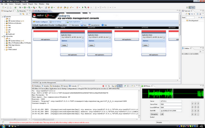

[[_afotsss_advanced_features_of_the_sip_servlets_server]]
= Advanced Features of the SIP Servlets Server

The advanced features of SIP Servlets include Concurrency and  Congestion Control, load balancing and clustering support with the Restcomm Load Balancer.

:leveloffset: 2

include::concept-section-SS_Media_Support.adoc[]

include::concept-section-SS_Concurrency_and_Congestion_Control.adoc[]

include::concept-section-SS_STUN_Support.adoc[]

include::concept-section-SS_JSR289_Extensions.adoc[]

include::concept-section-SS_CDI_Telco_Framework.adoc[]

include::concept-section-SS_Diameter_Support.adoc[]

include::concept-section-SS_SIP_Extensions.adoc[]

include::concept-section-SS_JSLEE_Interop.adoc[]

:leveloffset: 1

== Eclipse IDE Tools

The SIP Servlets Eclipse tools assist developers in creating JSR-289 applications with Restcomm.
You can use the Dynamic Web Project wizard for converged applications to get started with an empty project, and then test your application with a real SIP Phone right from the IDE.

.SIP Servlets Eclipse IDE Tools

=== Pre-Install requirements

Eclipse 3.4 is required.

=== Installation

The standard Eclipse update site installation mechanism is leveraged.
The Restcomm Update Site is at the following location: http://mobicents.googlecode.com/svn/downloads/sip-servlets-eclipse-update-site.
After adding this update site to Eclipse you can proceed with the regular Eclipse Plug-in Installation.
If you need help, the process is demonstrated in http://www.youtube.com/watch?v=LZOmLEC2IeQ[this video].

=== SIP Servlets Core Plug-in

This plug-in allows you to create Dynamic Web Projects with the SIP Facet.
There are a number of new Dynamic Web Project configurations for Converged applications.
It is best to use the ones marked as "recommended". After you complete the wizard, a complete converged project skeleton will be generated.
Working with this type of project is similar to working with normal Web projects.
You can see a demo http://people.redhat.com/vralev/mss-eclipse-plugin-demo/mss-eclipse.htm[here].

=== SIP Phone Plug-in

The SIP Phone plug-in integrates a SIP phone inside your Eclipse IDE.
You can use the phone to test your SIP or Media applications.
The phone uses the microphone and speakers on your computer and allows you to simulate real-world scenarios.
