[[_concept_chapter_ss_click2call]]
= Tomcat Servlet Click2call Windows Setup

Restcomm SIP Servlets Server can be run on a JBoss Application Server or on the Tomcat Servlet Container.
Here is how to install and configure both JBoss a Microsoft Windows based system. 

Tomcat Servlet running on Microsoft Windows The Restcomm Platform is based on Java, so you need to make sure you have both the Java Runtime Environment (JRE) and, or the Java Development Kit (JDK) installed on your Windows based system. 

You can download the http://www.java.com/en/[ Java Runtime Environment here ].
 

If you are a developer, you can get the http://www.oracle.com/technetwork/java/archive-139210.html[ Java Development Kit here ].
It is recommended that you install the latest version of JDK.
You can opt for the JDK Java SE (Standard Edition) for test purposes.
Once you have downloaded JDK, you will see an executable like the one below in your download folder.
 

* menu > Start > Run > CMD
+
.Testing if Java is installed and running
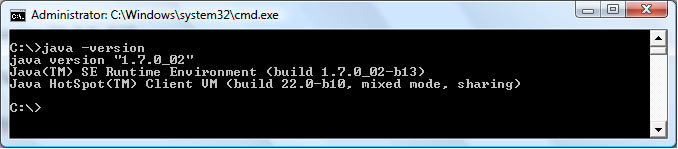

* Jdk-(version)-windows-i586.exe 
+
.JDK executable file
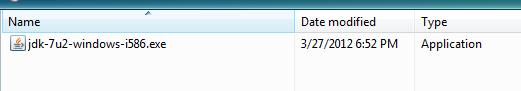

JAVA_Home enviroment variable.
In order for applications to interact with your Java installation, you need to specify the install location by setting the JAVA_HOME environment variable.
Start the 'cmd' without the quotes and press Enter 
----

Start > Run > cmd
----

In the CMD window, type 

----

Set JAVA_HOME=C:\Java\jdk1.7.0_02
----

.Set environment variable
image::images/click2call_set_env_variable_windows.png[]

This will set the environment variable for your session.
The ` C:\Java\jdk1.7.0_02 ` is the root folder where your JDK files are installed.
You can go to http://support.microsoft.com/kb/931715[ this Microsoft page ] to see how set your environment variable and make it permanent.
If you want to make sure the JDK environment variable is set, type 
----
 c:\> Set
----

Installing Restcomm Tomcat on Windows.
It is recommended that you install the latest Restcomm Sip Servlets.
You can download the &DOWNLOAD_LINK;link:[  SIP Servlets for Tomcat here ]
Make sure you download the latest Tomcat and not the JBoss.
 

.Download Restcomm  SIP Servlets for Tomcat
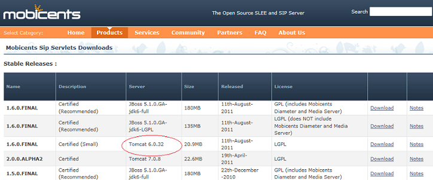
The downloaded file will appear similar to this screenshot below  

.Downloaded Tomcat File 
image::images/click2call_download_latest_version_tomcat.png[]
The extracted file will look similar to this folder 

.Content of Tomcat Directory
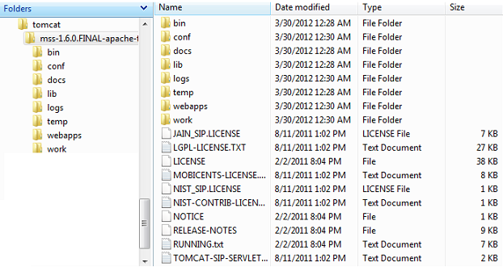  

Once you have extracted the content of the MSS Tomcat server zip file, you need to set the CATALINA_HOME environment variable.
Open the 'cmd' window  
----
 Start > run > cmd
----
In this example, the environment variable is set as follows: 
----
 set CATALINA_HOME=C:\tomcat\
----
Start the MSS Tomcat Server  The \bin directory in the root of your Tomcat folder holds the executables you need to work with the MSS server application.
To start the server, you need to execute the startup.bat file.
First, start the cmd window as follows: 
----

Start > run > cmd
----

.Start Tomcat Server
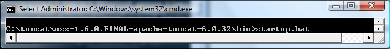
This will open another cmd.exe window similar to the one below   

.Tomcat Server Started
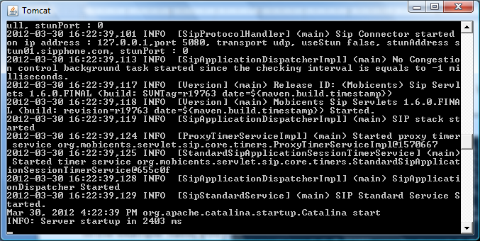
Note that the server is started and you can now begin to use the application. 

Once the MSS Tomcat server is up and running, you should be able to go to http://localhost:8080/  and see the web server in action.
If the page doesn`'t open or you get an error message saying page  is not found, the 8080 port might be in use by another service.
You will have to change the port  in the server.xml file located in the c:\TOMCAT_ROOT_FOLDER\conf\server.xml.
You will need a text editor like Notepad++ to change the connector.
Here is a screenshot of the server.xml file with the default port 8080.
 

.Tomcat Default Http Port
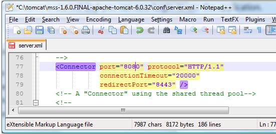
The port number must be higher than 1024.
In the example below, the port number for the connector has been change to 8040  

.Change Default Http Port to 8040
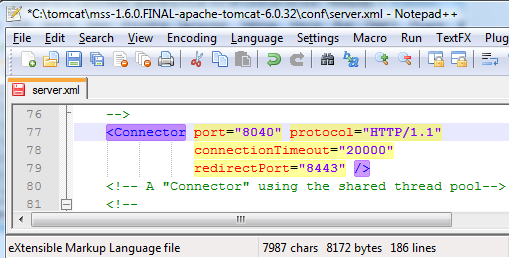

You can use your internet browser to see the result by going to ` http://localhost:8040 `
You will see a page similar to the screenshot below  

.Localhost Homepage
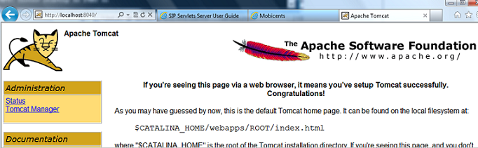
In order to manage the Click2call sip servlet clients, you need to navigate to the ` http://localhost:8040/click2call `
If you get an error message that says, page cannot be displayed, you need to make sure the MSS Tomcat server is running by executing the startup.bat file in the ` MSS_Tomcat_root_folder\bin\startup.bat `
Here is a screenshot of what the Click2call applet will look like without any registered soft phone clients   

.Click2call Homepage
image::images/click2call_sip_servlets_sample_application.png[]   

At the moment there are no registered users.
That is because you need to get the softphone clients to register with the Tomcat server you started above.
You need to install a minimum of two soft phones in order to be able to run the sip servlet Click2Call sample.
In this example, we shall be using 2 soft phones clients, _ WengoPhone and 3CXPhone. _
Download the latest version of the soft phones, install and configure them like the screenshots below:  

.Wengo Softphone Configuration
image::images/click2call_wengo_softphone_configuration.png[]   

You can use any username and password you desire.
The MSS Tomcat server is listening for calls on the _ 127.0.0.1:5080 port _

_ Configuring the 3CXPhone _  After the installation is complete, you can start up the 3CXPhone, you will see the screen below prompting you to create a profile.
Click on the Create Profile Button.
 

.3CXphone Profile
image::images/click2call_3cxphone_softphone_profile.png[]   In the Accounts window choose the _ 'New' _ button and configure as follows  

.3CXphone Softphone Configuration
image::images/click2call_3cxphone_softphone_configuration.png[]  

Once the 2 soft phone clients are configured with the SIP details,  you can go back to the ` http://localhost:8040/click2call/index.jsp page and you will see the clients registered with the server. `

.Registered Sip Clients
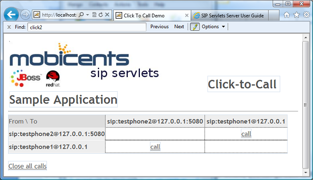  

Before you can make calls, you will need to specify the contact details of the person you want to call.
It is just like entering the phone number.
Because this is a SIP based setting, you will need to enter the SIP address instead of the phone number.
 

_ Testing the Soft Phones on Click2Call_
In order to be able to make a call from one phone to the other, you need to create a contact user.
Because you will be using the SIP protocol, you will need to type the contact details with the testphone1 SIP pointing to the 
----
 testphone2@127.0.0.1
----

.Wengo Phone Contact User Details
image::images/click2call_wengo_softphone_user_contact.png[]  

You need to do the same on the 3CXPhone contact.
The phone contact number will be 
----
 sip:testphone1@127.0.0.1:5080
----

.3CXPhone Contact User Details
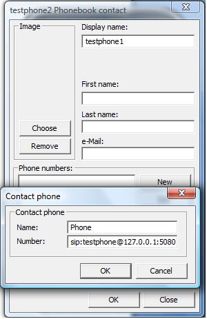  

Once you have both contact sip details configured, you can start to make calls and fully use the Click2call application.
 
