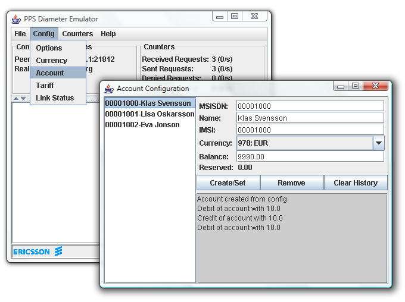

[[_sfss_services_for_sip_servlets]]
= Operating the Example Applications

.Important Information  
[NOTE]
====
Before trying out the examples in this section, you must have installed, configured and have Restcomm for JBoss or Restcomm for Tomcat AS7 running on your system. 

See the chapters below for detailed instructions. 

<<_getting_started_with_mss_jboss_as7>>  

<<_getting_started_with_mss_tomcat_as7>>  
====

[[_sfss_the_location_service]]
== The Location Service

The Restcomm Location Service contains a list of mappings of request URIs to destination addresses.
When the Location Service receives a request, it performs a lookup on that mapping and proxies the request simultaneously to the destination address (or addresses) associated with that URI.

.The Location Service Mappings Cannot Currently Be Configured
[NOTE]
====
The Location Service currently performs a lookup on a hard-coded list of addresses.
This model is evolving toward the eventual use of a database.
====

Regardless of whether you are using the JBoss Application Server or the Tomcat Servlet Container as the Servlets Server, the application, container and Location Service perform the following steps:

* A user--let us call her Alice--makes a call to ``sip:receiver@sip-servlets.com``.
  The ``INVITE`` is received by the servlet container, which then starts the Location Service.
* The Location Service, using non-SIP means, determines that the callee (i.e.
  the receiver) is registered at two locations, identified by the two SIP URIs, `sip:receiver@127.0.0.1:5090`
  and `sip:receiver@127.0.0.1:6090`.
* The Location Service proxies to those two destinations in parallel, without record-routing, and without making use of supervised mode.
* One of the destinations returns a `200 OK`
  status code; the second proxy is then canceled.
* The `200 OK` is forwarded to Alice, and call setup is completed as usual.

Here is the current list of hard-coded contacts and their location URIs:

* .sip:receiver@sip-servlets.com`sip:receiver@127.0.0.1:5090`
* `sip:receiver@127.0.0.1:6090`

[[_sfss_binary_location_service__installing_configuring_and_running]]

.Downloading
The Location Service is comprised of two archive files, a Web Archive (WAR) and a Default Application Router (DAR) configuration file, which you need to add to your installed SIP Servlets Server.
For more information about WAR files, refer to the http://www.jboss.org/file-access/default/members/jbossas/freezone/docs/Server_Configuration_Guide/beta422/html/index.html[JBoss Application Server Administration and Development Guide].
For more information about DAR files, refer to the http://jcp.org/en/jsr/detail?id=289[JSR 289 spec, Appendix C].

Download the Location Service's WAR file from here: &VERSION;&VERSION;https://oss.sonatype.org/content/groups/public/org/mobicents/servlet/sip/examples/location-service//location-service-.war.

Download the Location Service's DAR file from here: https://sipservlets.googlecode.com/git/sip-servlets-examples/location-service/locationservice-dar.properties.

.Installing
Both the [path]_location-service-.war_ WAR file and the [path]_locationservice-dar.properties_ DAR file that you downloaded should be placed into different directories in your SIP Servlet Server installation hierarchy.
Which directory depends on whether you are using the Location Service with Restcomm  for JBoss or with Restcomm  for Tomcat:

Restcomm  for JBoss AS7::
  Place [path]_location-service-.war_ into the [path]_$JBOSS_HOME/standalone/deployments/_
  directory, and [path]_locationservice-dar.properties_
  into the [path]_$JBOSS_HOME/standalone/configuration/dars/
  _
  directory.

Restcomm  for Tomcat AS7::
  Place [path]_location-service-.war_ into the [path]_$CATALINA_HOME/webapps/_
  directory, and [path]_locationservice-dar.properties_
  into the [path]_$CATALINA_HOME/conf/dars/_
  directory.

.Configuration

Restcomm  for JBoss::

Open the $JBOSS_HOME/standalone/configuration/standalone-sip.xml configuration file and find the mobicents subsystem element. 

.Editing MSS for JBoss's standalone-sip.xml for the Location Service
====
In the $JBOSS_HOME/standalone/configuration/standalone-sip.xml file search for the line 

 <subsystem xmlns="urn:org.mobicents:sip-servlets-as7:1.0" 
application-router="dars/mobicents-dar.properties" 

and replace it with the line below

 <subsystem xmlns="urn:org.mobicents:sip-servlets-as7:1.0"
 application-router="dars/locationservice-dar.properties" 
====

Restcomm  for Tomcat::
  Open the [path]_$CATALINA_HOME/conf/server.xml_
  configuration file and find the `Service`
  element.
  Add an attribute to it called ``darConfigurationFileLocation``, and set it to ``conf/dars/locationservice-dar.properties``:

.Editing MSS for Tomcat's server.xml for the Location Service
====
In the $JBOSS_HOME/standalone/configuration/standalone-sip.xml file search for the line 

 <subsystem xmlns="urn:org.mobicents:sip-servlets-as7:1.0" 
application-router="dars/mobicents-dar.properties" 

and replace it with the line below

 <subsystem xmlns="urn:org.mobicents:sip-servlets-as7:1.0"
 application-router="dars/locationservice-dar.properties" 
====

.Running
Once the WAR and DAR files have been placed in the right directories, and the JBoss Application Server or Tomcat Servlet Container knows where to find them (which you specified in the [path]_standalone-sip.xml_ and [path]_server.xml_ file), then you should go ahead and run the SIP Servlets Server.

.Testing
The following procedure shows how to test the Location Service.

.Procedure: 
. Start two SIP soft-phones.
  The first phone should be set up as ``sip:receiver@sip-servlets.com`` at the IP address ``127.0.0.1`` on port ``5090``.
  The second phone can be set up in any way you like.
  Note that the SIP phones do not have to be registered.
. Using the second phone, make a call to ``sip:receiver@sip-servlets.com``.
  If the Location Service has been set up correctly and is running, the first phone--as the receiver or callee--should now be ringing.

[[_sfss_the_diameter_event_changing_service]]
== The Diameter Event-Changing Service

The Diameter Event-Changing Service is based on the Location Service, which performs call-charging at a fixed rate.
Upon the initiation of a call, a debit of €10.00 occurs.
In the cases of a call being rejected or the caller disconnecting (hanging up) before an answer is received, the caller's account is refunded.

Note that an Restcomm for JBoss installation is required to run this example; it will not work with Restcomm for Tomcat.

Provided here is a step-by-step description of the procedure as performed by the application and container:

.Procedure: Diameter Event-Changing Service Step-By-Step
. A user, Alice, makes a call to ``sip:receiver@sip-servlets.com``.
  The ``INVITE`` is received by the servlet container, which sends a request to debit Alice's account to the Charging Server.
  The servlet container then invokes the location service.
. The Location Service determines, without using the SIP protocol itself, where the callee--or receiver--is registered.
  The callee may be registered at two locations identified by two SIP URIs: `sip:receiver@127.0.0.1:5090` and ``sip:receiver@127.0.0.1:6090``.
. The Location Service proxies to those two destinations simultaneously, without record-routing and without using the supervised mode.
. One of the destinations returns `200 (OK)`, and so the container cancels the other.
. The `200 (OK)` is forwarded upstream to Alice, and the call setup is carried out as usual.
. If none of the registered destinations accepts the call, a Diameter Accounting-Request for refund is sent to the Diameter Charging Server in order to debit the already-credited €10.00

[[_sfss_binary_diameter_event_changing_service__installing_configuring_and_running]]
=== Diameter Event-Changing Service: Installing, Configuring and Running

Preparing your Restcomm for JBoss server to run the Diameter Event-Changing example requires downloading a WAR archive, a DAR archive, the Ericsson Charging Emulator, setting an attribute in JBoss's [path]_standalone-sip.xml_ configuration file, and then running JBoss AS.
Detailed instructions in the section below.

.Pre-Install Requirements and Prerequisites
The following requirements must be met before installation can begin.

.Software Prerequisites
One Restcomm  for JBoss Installation::
  Before proceeding, you should follow the instructions for installing, configuring, running and testing Restcomm for JBoss from the binary distribution.

.Downloading
The following procedure describes how to download the required files.

. First, download the latest Web Application Archive () file corresponding to this example, the current version of which is named [path]_diameter-event-charging-*.war_, from &VERSION;&VERSION;https://oss.sonatype.org/content/groups/public/org/mobicents/servlet/sip/examples/diameter-event-charging//diameter-event-charging-.war.
. Secondly, download the corresponding Disk Archive () configuration file here: https://sipservlets.googlecode.com/git/sip-servlets-examples/diameter-event-charging/diametereventcharging-dar.properties.
. Finally, you will need to download the Ericsson Charging Emulator, version 1.0, from http://mobicents.googlecode.com/files/ChargingSDK-1_0_D31E.zip.

.Installing
The following procedure describes how to install the downloaded files.

. Place the [path]_diameter-event-charging-.war_
  WAR archive into the [path]_$JBOSS_HOME/standalone/deployments/_
  directory.
. Place the [path]_diametereventcharging-dar.properties_ DAR file in your $JBOSS_HOME/standalone/configuration/dars/  directory.
. Finally, open the terminal, move into the directory to which you downloaded the Ericsson Charging SDK (for the sake of this example, we will call this directory [path]_charging_sdk_), and then unzip the downloaded zip file (you can use Java's `jar -xvf` command for this:
+
----
~]$ cd charging_sdk
charging_sdk]$ jar -xvf ChargingSDK-1_0_D31E.zip
----
+
Alternatively, you can use Linux's `unzip`
command to do the dirty work:
+
----
charging_sdk]$ unzip ChargingSDK-1_0_D31E.zip
----

.Configuration

Restcomm  for JBoss::
Open the $JBOSS_HOME/standalone/configuration/standalone-sip.xml configuration file and find the mobicents subsystem element. 

.Editing the standalone-sip.xml for the Diameter Event-Changer Service
====
In the $JBOSS_HOME/standalone/configuration/standalone-sip.xml file search for the line 

 <subsystem xmlns="urn:org.mobicents:sip-servlets-as7:1.0" 
application-router="dars/mobicents-dar.properties" 

and replace it with the line below

 <subsystem xmlns="urn:org.mobicents:sip-servlets-as7:1.0"
 application-router="dars/diametereventcharging-dar.properties" 
====

.Running
The following procedure describes how to run the Diameter Event-Changing Service.

.Procedure: Diameter Event-Changing Service
. Then, run the Ericsson Charging Emulator.
  Open a terminal, change the working directory to the location of the unzipped Charging Emulator files (in [path]_ChargingSDK-1_0_D31E_ or a similarly-named directory), and run it with the `java -jar PPSDiamEmul.jar` command:
+
----
~]$ java -jar PPSDiamEmul.jar
----

.Using
Using the Event-Changing service means, firstly, inserting some parameters into the Charging Emulator, and then, by using two SIP (soft)phones, calling one with the other.
The following sequential instructions show you how.

.SIP (Soft)Phone? Which?
[NOTE]
====
The Restcomm team recommends one of the following SIP phones, and has found that they work well: the 3CX Phone, the SJ Phone or the WengoPhone.
====

.Procedure: Using the Diameter Event-Changing Service
. Configure the Ericsson SDK Charging Emulator
+
Once you have started the Charging Emulator, you should configure it exactly as portrayed in <<_figure_mss_chargingemulatorconfig>>.
+
.Configuring the Charging Emulator
image::images/mss-DiameterEventChanging-ss-ChargingEmulatorConfig.png[]
+
. Set the `Peer ID` to: `aaa://127.0.0.1:21812`
. Set the `Realm` to: `mobicents.org`
. Set the `Host IP` to: `127.0.0.1`

. Start two SIP (soft)phones.
  You should set the first phone up with the following parameters: `sip:receiver@sip-servlets` on IP address ``127.0.0.1`` on port ``5090``.
  The other phone can be set up any way you like.
. Before making a call, open the menu:Config[Options] dialog window, as shown in the image.
+
.Configuring Accounts in the Charging Emulator

+
In the [label]#Account Configuration# window of the Charging Emulator, you can see the user's balances.
Select a user to watch the balance.
You can also stretch the window lengthwise to view the user's transaction history.

. Time to call! From the second, "`any-configuration`" phone, make a call to ``sip:receiver@sip-servlets.com``.
  Upon doing so, the other phone should ring or signal that it is being contacted .
. You should be able to see a request--immediately following the invite and before the other party (i.e.
  you) accepts or rejects the call--sent to the Charging Emulator.
  That is when the debit of the user's account is made.
  In the case that the call is rejected, or the caller gives up, a second, new Diameter request is sent to refund the initial amount charged by the call.
  On the other hand, if the call is accepted, nothing else related to Diameter happens, and no second request takes place.
+
Please note that this is not the correct way to do charging, as Diameter provides other means, such as unit reservation.
However, for the purpose of a demonstration it is sufficient to show the debit and follow-up credit working.
Also, this is a fixed-price call, regardless of the duration.
Charging can, of course, be configured so that it is time-based.

[[_sfss_the_call_blocking_service]]
== The Call-Blocking Service

The Restcomm Call-Blocking Service, upon receiving an ``INVITE`` request, checks to see whether the sender's address is a blocked contact.
If so, it returns a ``FORBIDDEN`` reply; otherwise, call setup proceeds as normal.

.Blocked Contacts Cannot Currently Be Configured
[NOTE]
====
Blocked contacts are currently hard-coded addresses.
This model is evolving towards the eventual use of a database.
====

Here is the current hard-coded list of blocked contacts:

* `sip:blocked-sender@sip-servlets.com`
* `sip:blocked-sender@127.0.0.1`

[[_sfss_binary_call_blocking_service__installing_configuring_and_running]]
=== The Call-Blocking Service: Installing, Configuring and Running

 

.Software Prerequisites
Either an Restcomm  for JBoss or an Restcomm  for Tomcat Installation::
  The Call-Blocking Service requires either an Restcomm for JBoss or an Restcomm for Tomcat binary installation.

.Downloading
The Call-Blocking Service is comprised of two archive files, a Web Archive (WAR) and a Default Application Router (DAR) configuration file, which you need to add to your installed SIP Servlets Server.
For more information about WAR files, refer to the http://www.jboss.org/file-access/default/members/jbossas/freezone/docs/Server_Configuration_Guide/beta422/html/index.html[JBoss Application Server Administration and Development Guide].
For more information about DAR files, refer to the http://jcp.org/en/jsr/detail?id=289[JSR 289 spec, Appendix C].

Download the Call-Blocking Service's WAR file from here: &VERSION;&VERSION;https://oss.sonatype.org/content/groups/public/org/mobicents/servlet/sip/examples/call-blocking//call-blocking-.war.

Download the Call-Blocking Service's DAR file from here: https://sipservlets.googlecode.com/git/sip-servlets-examples/call-blocking/call-blocking-servlet-dar.properties.

.Installing
Both the [path]_call-blocking-.war_ WAR file and the [path]_call-blocking-servlet-dar.properties_ DAR file that you downloaded should be placed into different directories in your SIP Servlet Server installation hierarchy.
Which directory depends on whether you are using the Call-Blocking Service with Restcomm  for JBoss or with Restcomm  for Tomcat:

Restcomm  for JBoss::
  Place [path]_call-blocking-.war_ into the [path]_$JBOSS_HOME/standalone/deployments/_
  directory, and [path]_call-blocking-servlet-dar.properties_ into the [path]_$JBOSS_HOME/standalone/configuration/dars/_
  directory.

Restcomm  for Tomcat::
  Place [path]_call-blocking-servlet-dar.properties_ into the [path]_$CATALINA_HOME/webapps/_
  directory, and [path]_call-blocking-servlet-dar.properties_ into the [path]_$CATALINA_HOME/conf/dars/_
  directory.

.Configuring

Restcomm  for JBoss::

Open the $JBOSS_HOME/standalone/configuration/standalone-sip.xml configuration file and find the mobicents subsystem element. 

.Editing MSS for JBoss's standalone-sip.xml for the Location Service
====
In the $JBOSS_HOME/standalone/configuration/standalone-sip.xml file search for the line 

 <subsystem xmlns="urn:org.mobicents:sip-servlets-as7:1.0" 
application-router="dars/mobicents-dar.properties" 

and replace it with the line below

 <subsystem xmlns="urn:org.mobicents:sip-servlets-as7:1.0"
 application-router="dars/call-blocking-servlet-dar.properties" 
====

Restcomm  for Tomcat::
  Open the [path]_$CATALINA_HOME/conf/server.xml_
  configuration file and find the `Service`
  element.
  Add an attribute to it called ``darConfigurationFileLocation``, and set it to ``conf/dars/call-blocking-servlet-dar.properties``:

.Editing MSS for Tomcat's server.xml for the Location Service
====
In the $JBOSS_HOME/standalone/configuration/standalone-sip.xml file search for the line 

 <subsystem xmlns="urn:org.mobicents:sip-servlets-as7:1.0" 
application-router="dars/mobicents-dar.properties" 

and replace it with the line below

 <subsystem xmlns="urn:org.mobicents:sip-servlets-as7:1.0"
 application-router="dars/call-blocking-servlet-dar.properties" 
====

.Running
Once the WAR and DAR files have been placed in the right directories, and the JBoss Application Server or Tomcat Servlet Container knows where to find them (which you specified in a [path]_server.xml_ and the [path]_standalone-sip.xml_  files), then you should go ahead and run the SIP Servlets Server.

.Testing
The following procedure shows how to test the Call-Blocking Service.

.Procedure: Testing the Call Blocking Service
. Start a SIP softphone of your choice.
  The account name should be `blocked-sender`.
  The `From Header` should list one of the following addresses: `sip:blocked-sender@sip-servlets.com` or ``sip:blocked-sender@127.0.0.1``.
  The SIP softphone does not need to be registered.
. Make a call to any address, and you should receive a ``FORBIDDEN`` response.

[[_sfss_the_call_forwarding_service]]
== The Call-Forwarding Service

The Restcomm Call-Forwarding Service, upon receiving an ``INVITE`` request, checks to see whether the sender's address is among those in a list of addresses which need to be forwarded.
If so, then the Call-Forwarding Service acts as a Back-to-Back User Agent (B2BUA), and creates a new call leg to the destination.
When the response is received from the new call leg, it sends it an acknowledgment (`ACK`) and then responds to the original caller.
If, on the other hand, the server does not receive an `ACK`, then it tears down the new call leg with a `BYE`.
Once the `BYE` is received, then it answers ``OK`` directly and sends the `BYE` to the new call leg.

.Contacts to Forward Cannot Currently Be Configured
[NOTE]
====
Contacts to forward are currently hard-coded addresses.
This model is evolving toward the eventual use of a database.
====

Here is the current hard-coded list of contacts to forward:

* `sip:receiver@sip-servlets.com`
* `sip:receiver@127.0.0.1`

[[_sfss_binary_call_forwarding_service__installing_configuring_and_running]]
=== The Call-Forwarding Service: Installing, Configuring and Running

 

.Pre-Install Requirements and Prerequisites
The following requirements must be met before installation can begin.

.Downloading
The Call-Forwarding Service is comprised of two archive files, a Web Archive (WAR) and a Data Archive (DAR), which you need to add to your installed SIP Servlets Server.
For more information about WAR and DAR files, refer to the http://www.jboss.org/file-access/default/members/jbossas/freezone/docs/Server_Configuration_Guide/beta422/html/index.html[JBoss Application Server Administration and Development Guide].

Download the Call-Forwarding Service's WAR file from here: &VERSION;&VERSION;https://oss.sonatype.org/content/groups/public/org/mobicents/servlet/sip/examples/call-forwarding//call-forwarding-.war.

Download the Call-Forwarding Service's DAR file from here: https://sipservlets.googlecode.com/git/sip-servlets-examples/call-forwarding/call-forwarding-b2bua-servlet-dar.properties.

.Installing
Both the [path]_call-forwarding-.war_ WAR file and the [path]_call-forwarding-servlet-dar.properties_
DAR file that you downloaded should be placed into different directories in your SIP Servlet Server installation hierarchy.
Which directory depends on whether you are using the Call-Forwarding Service with Restcomm  for JBoss or with Restcomm  for Tomcat:

Restcomm  for JBoss::
  Place [path]_call-forwarding-.war_ into the [path]_$JBOSS_HOME/standalone/deployments/_
  directory, and [path]_call-forwarding-servlet-dar.properties_ into the [path]_$JBOSS_HOME/standalone/configuration/dars/_
  directory.

Restcomm  for Tomcat::
  Place [path]_call-forwarding-.war_ into the [path]_$CATALINA_HOME/webapps/_
  directory, and [path]_call-forwarding-servlet-dar.properties_ into the [path]_$CATALINA_HOME/conf/dars/_
  directory.

.Configuring

Restcomm  for JBoss::

Open the $JBOSS_HOME/standalone/configuration/standalone-sip.xml configuration file and find the mobicents subsystem element. 

.Editing MSS for JBoss's standalone-sip.xml for the Location Service
====
In the $JBOSS_HOME/standalone/configuration/standalone-sip.xml file search for the line 

 <subsystem xmlns="urn:org.mobicents:sip-servlets-as7:1.0" 
application-router="dars/mobicents-dar.properties" 

and replace it with the line below

 <subsystem xmlns="urn:org.mobicents:sip-servlets-as7:1.0"
 application-router="dars/call-forwarding-b2bua-servlet.properties" 
====

Restcomm  for Tomcat::
  Open the [path]_$CATALINA_HOME/conf/server.xml_
  configuration file and find the `Service`
  element.
  Add an attribute to it called ``darConfigurationFileLocation``, and set it to ``conf/dars/call-forwarding-b2bua-servlet-dar.properties``:

.Editing MSS for Tomcat's server.xml for the Location Service
====
In the $JBOSS_HOME/standalone/configuration/standalone-sip.xml file search for the line 

 <subsystem xmlns="urn:org.mobicents:sip-servlets-as7:1.0" 
application-router="dars/mobicents-dar.properties" 

and replace it with the line below

 <subsystem xmlns="urn:org.mobicents:sip-servlets-as7:1.0"
 application-router="dars/call-forwarding-b2bua-servlet-dar.properties" 
====

.Running
Once the WAR and DAR files have been placed in the right directories, and the JBoss Application Server or Tomcat Servlet Container knows where to find them (which you specified in a [path]_standalone-sip.xml_ and [path]_server.xml_  files), then you should go ahead and run the SIP Servlets Server.

.Testing
The following procedure shows how to test the Call-Forwarding Service.

.Procedure: 
. Start two SIP soft-phones of your choice.
  Set the account settings of the first SIP softphone to:
+
* Account name: `forward-receiver`
* IP address: `127.0.0.1`
* Port: `5090`
+
Neither of the SIP soft-phones needs to be registered.

. From the second phone, make a call to ``sip:receiver@sip-servlets.com``.
  The first phone, "forward-receiver", should now be ringing.

[[_sfss_the_call_controller_service]]
== The Call-Controller Service

The Call-Controller service is a composition of two other services: Call-Blocking and Call-Forwarding.
Essentially, it performs the services of both call-forwarding and call-blocking.

* To learn about how the Call-Blocking service works, refer to <<_sfss_the_call_blocking_service>>.
* To learn about how the Call-Forwarding service works, refer to <<_sfss_the_call_forwarding_service>>.

.Blocked Contacts and Contacts to Forward Cannot Currently Be Configured
[NOTE]
====
Both the list of blocked contacts and the list of contacts to forward are currently both hard-coded.
However, both of those models are evolving toward the eventual use of databases.
====

[[_sfss_binary_call_controller_service__installing_configuring_and_running]]
=== The Call-Controller Service: Installing, Configuring and Running

The Call-Controller service requires the two WAR files for the Call-Blocking and Call-Forwarding services to be placed in the correct directory inside your Restcomm SIP Servlets Server binary installation.
However, the Call-Controller service does _not_
require their corresponding DAR files: you need only to download and install a DAR file customized for the Call-Controller service.
The instructions below show you how to do precisely this; there is no need, therefore, to first install either the Call-Blocking or the Call-Forwarding services, though it is helpful to at least be familiar with them.

.Pre-Install Requirements and Prerequisites
The following requirements must be met before installation can begin.

.Downloading
The Call-Controller Service is comprised of two WAR files, one for the Call-Forwarding service and one for Call-Blocking, and a customized Call-Controller DAR file.
You do not need to install the DAR files for the Call-Forwarding or the Call-Blocking services.
For more information about WAR files, refer to the http://www.jboss.org/file-access/default/members/jbossas/freezone/docs/Server_Configuration_Guide/beta422/html/index.html[JBoss Application Server Administration and Development Guide].
For more information about DAR files, refer to the http://jcp.org/en/jsr/detail?id=289[JSR 289 spec, Appendix C]

Download the Call-Blocking Service's WAR file from here: &VERSION;&VERSION;https://oss.sonatype.org/content/groups/public/org/mobicents/servlet/sip/examples/call-blocking//call-blocking-.war.

Download the Call-Forwarding Service's WAR file from here: &VERSION;&VERSION;https://oss.sonatype.org/content/groups/public/org/mobicents/servlet/sip/examples/call-forwarding//call-forwarding-.war.

Download the Call-Controller Service's DAR file from here: https://sipservlets.googlecode.com/git/sip-servlets-examples/call-blocking/call-controller-servlet-dar.properties.

.Installing
The [path]_call-blocking-.war_, [path]_call-forwarding-.war_ and [path]_call-controller-servlet-dar.properties_ archive files that you downloaded should be placed into different directories in your SIP Servlet Server installation hierarchy.
Which directory depends on whether you are using the Call-Controller Service with Restcomm 
for JBoss or with Restcomm  for Tomcat:

Restcomm  for JBoss::
  Place [path]_call-blocking-.war_ and [path]_call-forwarding-.war_ into the [path]_$JBOSS_HOME/standalone/deployments/_
  directory, and [path]_call-controller-servlet-dar.properties_ into the [path]_$JBOSS_HOME/standalone/configuration/dars/_
  directory.

Restcomm  for Tomcat::
  Place [path]_call-blocking-.war_ and [path]_call-forwarding-.war_ into the [path]_$CATALINA_HOME/webapps/_
  directory, and [path]_call-controller-servlet-dar.properties_ into the [path]_$CATALINA_HOME/conf/dars/_
  directory.

.Configuring

RRestcomm  for JBoss::

Open the $JBOSS_HOME/standalone/configuration/standalone-sip.xml configuration file and find the mobicents subsystem element. 

.Editing MSS for JBoss's standalone-sip.xml for the Location Service
====
In the $JBOSS_HOME/standalone/configuration/standalone-sip.xml file search for the line 

 <subsystem xmlns="urn:org.mobicents:sip-servlets-as7:1.0" 
application-router="dars/mobicents-dar.properties" 

and replace it with the line below

 <subsystem xmlns="urn:org.mobicents:sip-servlets-as7:1.0"
 application-router="dars/call-forwarding-b2bua-servlet.properties" 
====

Restcomm  for Tomcat::
  Open the [path]_$CATALINA_HOME/conf/server.xml_
  configuration file and find the `Service`
  element.
  Add an attribute to it called ``darConfigurationFileLocation``, and set it to ``conf/dars/call-controller-servlet-dar.properties``:

.Editing MSS for Tomcat's server.xml for the Location Service
====
In the $JBOSS_HOME/standalone/configuration/standalone-sip.xml file search for the line 

 <subsystem xmlns="urn:org.mobicents:sip-servlets-as7:1.0" 
application-router="dars/mobicents-dar.properties" 

and replace it with the line below

 <subsystem xmlns="urn:org.mobicents:sip-servlets-as7:1.0"
 application-router="dars/call-controller-servlet-dar.properties" 
====

.Running
Once the WAR and DAR files have been placed in the right directories, and the JBoss Application Server or Tomcat Servlet Container knows where to find them (which you specified in a [path]_server.xml_ file), then you should go ahead and run the SIP Servlets Server.

.Testing
Two use-cases can be distinguished for the Call-Controller service: one in which a call is blocked, and another in which a call is forwarded.
Therefore, we have two cases for which we can test the Call-Controller.

.Procedure: Blocking a Call with Call-Controller
. Start two SIP soft-phones of your choice.
  Set the account settings of the SIP soft-phones to:
+
* .Relevant First Softphone SettingsAccount name: `forward-receiver`
* IP address: `127.0.0.1`
* Port: `5090`
+
* .Relevant Second Softphone SettingsAccount name: `blocked-sender`
+
Neither of the SIP soft-phones needs to be registered.

. From the second phone, `blocked-sender`, make a call to `sip:receiver@sip-servlets.com`.
  You should receive a `FORBIDDEN` response.

.Procedure: Forwarding a Call with Call-Controller
. Start two SIP soft-phones of your choice.
  Set the account settings of the SIP soft-phones to:
+
* .Relevant First Softphone SettingsAccount name: `forward-receiver`
* IP address: `127.0.0.1`
* Port: `5090`
+
* .Relevant Second Softphone SettingsAccount name: `forward-sender`
+
Neither of the SIP soft-phones needs to be registered.

. From the second softphone, `forward-sender`, make a call to `sip:receiver@sip-servlets.com`.
  The first phone, `forward-receiver`, should now be ringing.

NOTE: <<_ssea_sip_servlet_example_applications>>
provides more information about other service examples available.

link:concept-chapter-SS_click2call.adoc[Click To Call]

