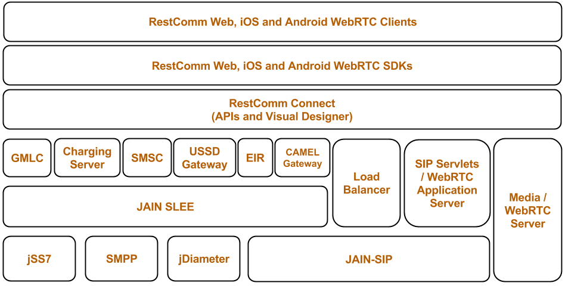

= Introduction

== Overview of Restcomm SIP Servlets within the Telecommunications Industry

The http://www.restcomm.com/[ Restcomm Communication Platform ] is the best architecture to create, deploy and manage services and applications integrating voice, video and data across a range of IP and legacy communications networks.
It drives convergence with the following key enablers: 

.Restcomm Architecture Overview

== Overview of SIP Servlets Server

Restcomm SIP Servlets is a modern communications middleware platform. RestcommSIP Servlets facilitates the shift towards Cloud Communications by enabling deployment and autoscaling of real time SIP Servlets apps across all major IaaS (Infrastructure as a Service) providers and also brings realtime communications (voice and video) to your Browser using HTML5 http://www.webrtc.org/[WebRTC ] and SIP Over WebSockets !  

The link: http://code.google.com/p/sipservlets/wiki/HTML5WebRTCVideoApplication[  HTML5 WebRTC Client ]allows you to make video calls from and to any Web Browser supporting http://www.webrtc.org/[WebRTC ] , (only Google Chrome supports it so far but all major browsers should support it in the next 6 months) as well as SIP Endpoints. 

Restcomm SIP Servlets enables turnkey SaaS offerings such as http://www.restcomm.com/[ RestComm ]. 

Restcomm SIP Servlets implements the latest SIP Servlet v1.1 (JSR 289) standard.
It can be plugged into any Application Server container (currently 7.X and JBoss 7.X) and also offers High Availability and Failover. 

Restcomm SIP Servlets is lead by http://www.telestax.com/[TeleStax, Inc ].
and developed collaboratively by a community of individual and enterprise contributors.
 

.Restcomm WebRTC SIP Stack
image::images/mss_webrtc_stack.png[]
