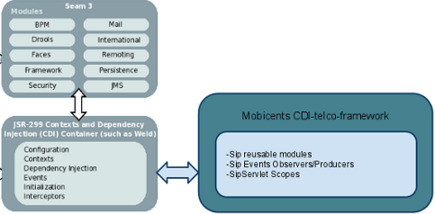

[[_stf_cdi_telco_framework]]
= CDI Telco Framework

CDI is the Java standard for dependency injection and contextual lifecycle management, led by Gavin King for Red Hat, Inc.
and is a Java Community Process(JCP) specification that integrates cleanly with the Java EE platform.
Any Java EE 6-compliant application server provides support for JSR-299 (even the web profile). It seemed a natural fit create a new framework based on CDI for the Telco world.

CDI-Telco-Framework (CTF) from Restcomm brings the power and productivity benefits of CDI into the Restcomm Sip Servlets platform providing dependency injection and contextual lifecycle management for converged HTTP/SIP applications.
This new framework is intended to become a replacement for our previous Seam Telco Framework.

CTF mission statement is to simplify SipServlets development by introducing a component based programming model, ease of development by making available SIP utilities out of the box, and finally providing dependency injection and contextual lifecycle management to the SipServlets.

.CDI Telco Framework Extension

More information about the CTF can be found on the http://docs.jboss.org/mobicents/frameworks/ctf/1.0.0.ALPHA1/user_guide/en-US/html_single/[CDI Telco Framework Documentation]. 
