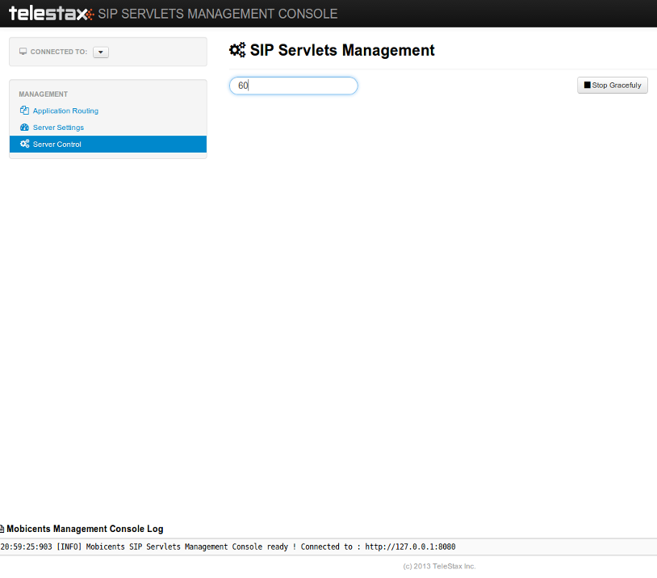

[[_ssfjfs_ss_gracefulshutdown]]
= Restcomm Graceful Shutdown

Graceful shutdown of a server or SIP/Web Applications is when existing request/connections/sessions are allowed to gracefully complete while no new requests and/or connections and/or sessions are accepted.
SIP Servlets Container or Applications can be gracefully shutdown through the Management Console, JMX or CLI as described below

As soon as the shutdown command is given, the container will stop the applications so that they do not accept any more inbound connections.
It will inform also load balancers that the server is no longer part of the cluster if the command is given on the container and not an individual application.
The Applications are closed so that they do not accept any more requests, but the requests currently inside the container will drain out and the Server instance will shutdown after the grace period expires.

[[_ssfjfs_ss_mssconsole_gracefulshutdown]]
== Graceful Shutdown through Restcomm  SIP Servlets Management Console

.Graceful Shutdown of Container through Restcomm  SIP Servlets Management Console

[[_ssfjfs_ss_wildfly_eap_cli_gracefulshutdown]]
== Graceful Shutdown of Container or Applications through Restcomm  JBoss AS/EAP Command Line Interface

`To Gracefully shutdown an Application through the CLI `, use the following command 
----
sh bin/jboss-cli.sh --connect  /subsystem=sip:contextGracefulShutdown\(timeToWait=30000,sipApp=appNameFromDeploymentDescriptor)
---- 

`To Gracefully shutdown an Application through the CLI `, use the following command 
----
sh bin/jboss-cli.sh --connect  /subsystem=sip:gracefulShutdown\(timeToWait=30000\)
----

[[_ssfjfs_ss_jmxconsole_gracefulshutdown]]
== Graceful Shutdown of Container or Applications through Restcomm  SIP Servlets JMX Console

`To Gracefully shutdown an Application through the JMX Console, Find the 'SipManager' MBean corresponding to your application and go to the 'stopGracefully' operation, Fill out the 'Time To Wait' Field and click 'Invoke' Button ` 

`To Gracefully shutdown the Container through the JMX Console, Find the 'jboss.web:type=SipApplicationDispatcher' MBean and go to the 'stopGracefully' operation, Fill out the 'Time To Wait' Field and click 'Invoke' Button ` 
