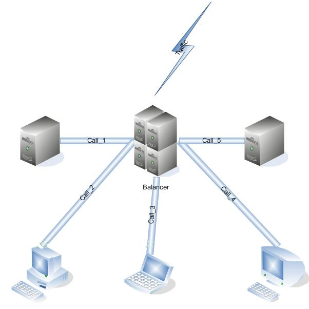
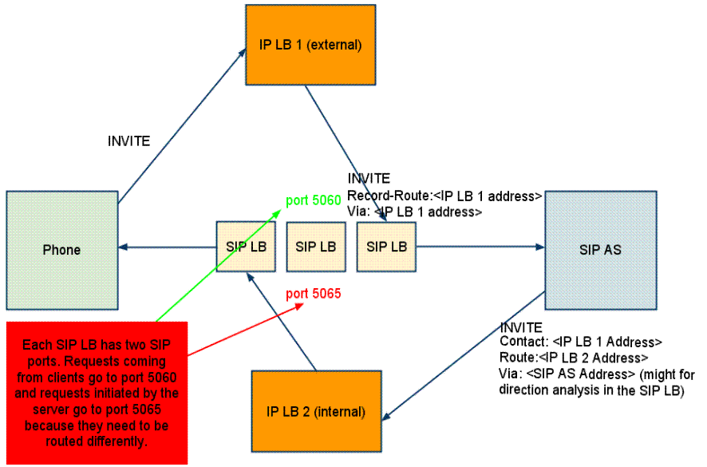

[[_sslb_mss_load_balancer]]
= Load Balancer

.Star Cluster Topology.

The SIP Load Balancer is used to balance the load of SIP service requests and responses between nodes in a SIP Servlets Server cluster.
Both Restcomm for JBoss and Restcomm for Tomcat servers can be used in conjunction with the SIP Load Balancer to increase the performance and availability of SIP services and applications. 

In terms of functionality, the SIP Load Balancer is a simple stateless proxy server that intelligently forwards SIP session requests and responses between User Agents (UAs) on a Wide Area Network (WAN), and SIP Servlets Server nodes, which are almost always located on a Local Area Network (LAN). All SIP requests and responses pass through the SIP Load Balancer.

[[_sslb_binary_sip_load_balancer_installing_configuring_and_running]]
== SIP Load Balancer: Installing, Configuring and Running

[[_sslb_binary_sip_load_balancer_preinstall_requirements_and_prerequisites]]
=== Pre-Install Requirements and Prerequisites

.Software Prerequisites
A JAIN SIP HA-enabled application server such as  Restcomm  JAIN SLEE or  Restcomm  SIP Servlets is required. ::
  Running the SIP Load Balancer requires at least two instances of the application server as cluster nodes nodes.
  Therefore, before configuring the SIP Load Balancer, we should make sure we've installed a the SIP application server first.
  The Restcomm SIP load balancer will work with a SIP Servlets-enabled JBoss Application Server _or_ a JAIN SLEE application server with SIP RA.

[[_sslb_binary_sip_load_balancer_downloading]]
=== Downloading

The load balancer is located in the [path]_sip-balancer_ top-level directory of the Restcomm  distribution.
You will find the following files in the directory:

SIP load balancer executable JAR file::
  This is the binary file with all dependencies

SIP load balancer Configuration Properties file::
  This is the properties files with various settings

[[_sslb_binary_sip_load_balancer_installing]]
=== Installing

The SIP load balancer executable JAR file can be extracted anywhere in the file system.
It is recommended that the file is placed in the directory containing other JAR executables, so it can be easily located in the future.

[[_sslb_binary_sip_load_balancer_configuring]]
=== Configuring

Configuring the SIP load balancer and the two SIP Servlets-enabled Server nodes is described in <<_sslb_configuring_the_sip_load_balancer_and_servlet_server_nodes>>.

[[_sslb_configuring_the_sip_load_balancer_and_servlet_server_nodes]]
.Procedure: Configuring the Restcomm  SIP Load Balancer and SIP Server Nodes
. Configure lb.properties Configuration Properties File
+
Configure the SIP Load Balancer's Configuration Properties file by substituting valid values for your personal setup. <<_sslb_complete_sample_lb.properties_file>>  shows a sample [path]_lb.properties_ file, with key element descriptions provided after the example.
The lines beginning with the pound sign are comments.
+
[[_sslb_complete_sample_lb.properties_file]]
.Complete Sample lb.properties File
====

----

#  Load Balancer Settings
# For an overview of the   Load Balancer visit 
# http://docs.google.com/present/view?id=dc5jp5vx_89cxdvtxcm
# The Load balancer will listen for both TCP and UDP connections

# The binding address of the load balancer. This also specifies the 
# default value for both internalHost and externalHost if not specified separately.
host=127.0.0.1

# The binding address of the load balancer where clients should connect (if the host property is not specified)
#externalHost=127.0.0.1

# The SIP port from where servers will receive messages
# delete if you want to use only one port for both inbound and outbound)
internalPort=5065

# The SIP port used where clients should connect
externalPort=5060

# The binding address of the load balancer where SIP application servers should connect (if the host property is not specified)
#internalHost=127.0.0.1

# The RMI port used for heartbeat signals
rmiRegistryPort=2000

# The HTTP port for HTTP forwarding
# if you like to activate the integrated HTTP load balancer, this is the entry point
httpPort=2080
#If no nodes are active the LB can redirect the traffic to the unavailableHost specified in this property,
#otherwise, it will return 503 Service Unavailable
#unavailableHost=google.com

# If you are using IP load balancer, put the IP address and port here
#externalIpLoadBalancerAddress=127.0.0.1
#externalIpLoadBalancerPort=111
 
# Requests initited from the App Servers can route to this address (if you are using 2 IP load balancers for bidirectional SIP LB)
#internalIpLoadBalancerAddress=127.0.0.1
#internalIpLoadBalancerPort=111

# The addresses in the SIP LB Via headers can be either the real addresses or those specified in the external and internal IP LB addresses
useIpLoadBalancerAddressInViaHeaders=false

# Designate extra IP addresses as serer nodes
#extraServerNodes=222.221.21.12:21,45.6.6.7:9003,33.5.6.7,33.9.9.2

# Call-ID affinity algortihm settings. This algorithm is the default. No need to uncomment it.
#algorithmClass=org.mobicents.tools.sip.balancer.CallIDAffinityBalancerAlgorithm
# This property specifies how much time to keep an association before being evitcted.
# It is needed to avoid memory leaks on dead calls. The time is in seconds.
#callIdAffinityMaxTimeInCache=500
#The following attribute specified the policy after failover. If set to true all calls from the failed node
#will go to a new healthy node (all calls to the same node). If set to false the calls will go to random new nodes.
#callIdAffinityGroupFailover=false

# Uncomment to enable the consistent hash based on Call-ID algorithm.
#algorithmClass=org.mobicents.tools.sip.balancer.HeaderConsistentHashBalancerAlgorithm
# This property is not required, it defaults to Call-ID if not set, cna be "from.user" or "to.user" when you want the SIP URI username
#sipHeaderAffinityKey=Call-ID
#specify the GET HTTP parameter to be used as hash key
#httpAffinityKey=appsession
 
# Uncomment to enable the persistent consistent hash based on Call-ID algorithm.
#algorithmClass=org.mobicents.tools.sip.balancer.PersistentConsistentHashBalancerAlgorithm
# This property is not required, it defaults to Call-ID if not set
#sipHeaderAffinityKey=Call-ID
#specify the GET HTTP parameter to be used as hash key
#httpAffinityKey=appsession
 
#This is the JBoss Cache 3.1 configuration file (with jgroups), if not specified it will use default
#persistentConsistentHashCacheConfiguration=/home/config.xml
 
# Call-ID affinity algortihm settings. This algorithm is the default. No need to uncomment it.
#algorithmClass=org.mobicents.tools.sip.balancer.CallIDAffinityBalancerAlgorithm
# This property specifies how much time to keep an association before being evitcted.
# It is needed to avoid memory leaks on dead calls. The time is in seconds.
#callIdAffinityMaxTimeInCache=500

# Uncomment to enable the consistent hash based on Call-ID algorithm.
#algorithmClass=org.mobicents.tools.sip.balancer.HeaderConsistentHashBalancerAlgorithm
# This property is not required, it defaults to Call-ID if not set, cna be "from.user" or "to.user" when you want the SIP URI username
#sipHeaderAffinityKey=Call-ID
#specify the GET HTTP parameter to be used as hash key
#httpAffinityKey=appsession

# Uncomment to enable the persistent consistent hash based on Call-ID algorithm.
#algorithmClass=org.mobicents.tools.sip.balancer.PersistentConsistentHashBalancerAlgorithm
# This property is not required, it defaults to Call-ID if not set
#sipHeaderAffinityKey=Call-ID
#specify the GET HTTP parameter to be used as hash key
#httpAffinityKey=appsession
 
#This is the JBoss Cache 3.1 configuration file (with jgroups), if not specified it will use default
#persistentConsistentHashCacheConfiguration=/home/config.xml

#If a node doesnt check in within that time (in ms), it is considered dead
nodeTimeout=5100
#The consistency of the above condition is checked every heartbeatInterval milliseconds
heartbeatInterval=150

#JSIP stack configuration.....
javax.sip.STACK_NAME = SipBalancerForwarder
javax.sip.AUTOMATIC_DIALOG_SUPPORT = off
# You need 16 for logging traces. 32 for debug + traces.
# Your code will limp at 32 but it is best for debugging.
gov.nist.javax.sip.TRACE_LEVEL = 0

// Specify if message contents should be logged.
gov.nist.javax.sip.LOG_MESSAGE_CONTENT=false

gov.nist.javax.sip.DEBUG_LOG = logs/sipbalancerforwarderdebug.txt
gov.nist.javax.sip.SERVER_LOG = logs/sipbalancerforwarder.xml
gov.nist.javax.sip.THREAD_POOL_SIZE = 64
gov.nist.javax.sip.REENTRANT_LISTENER = true
----
====
+

host::
  Local IP address, or interface, on which the SIP load balancer will listen for incoming requests.

externalPort::
  Port on which the SIP load balancer listens for incoming requests from SIP User Agents.

internalPort::
  Port on which the SIP load balancer forwards incoming requests to available, and healthy, SIP Server cluster nodes.

rmiRegistryPort::
  Port on which the SIP load balancer will establish the RMI heartbeat connection to the application servers.
  When this connection fails or a disconnection instruction is received, an application server node is removed and handling of requests continues without it by redirecting the load to the lie nodes.

httpPort::
  Port on which the SIP load balancer will accept HTTP requests to be distributed across the nodes.

internalTransport::
  Transport protocol for the internal SIP connections associated with the internal SIP port of the load balancer.
  Possible choices are `UDP`, `TCP` and `TLS`.

externalTransport::
  Transport protocol for the external SIP connections associated with the external SIP port of the load balancer.
  Possible choices are `UDP`, `TCP` and `TLS`.
  It must match the transport of the internal port.

externalIpLoadBalancerAddress::
  Address of the IP load balancer (if any) used for incoming requests to be distributed in the direction of the application server nodes.
  This address may be used by the SIP load balancer to be put in SIP headers where the external address of the SIP load balancer is needed.

externalIpLoadBalancerPort::
  The port of the external IP load balancer.
  Any messages arriving at this port should be distributed across the external SIP ports of a set of   SIP load balancers.

internalIpLoadBalancerAddresst::
  Address of the IP load balancer (if any) used for outgoing requests (requests initiated from the servers) to be distributed in the direction of the clients.
  This address may be used by the SIP load balancer to be put in SIP headers where the internal address of the SIP load balancer is needed.

internalIpLoadBalancerPort::
  The port of the internal IP load balancer.
  Any messages arriving at this port should be distributed across the internal SIP ports of a set of   SIP load balancers.

extraServerNodes::
  Comma-separated list of hosts that are server nodes.
  You can put here alternative names of the application servers here and they will be recognized.
  Names are important, because they might be used for direction-analysis.
  Requests coming from these server will go in the direction of the clients and will not be routed back to the cluster.

algorithmClass::
  The fully-qualified Java class name of the balancing algorithm to be used.
  There are three algorithms to choose from and you can write your own to implement more complex routing behaviour.
  Refer to the sample configuration file for details about the available options for each algorithm.
  Each algorithm can have algorithm-specific properties for fine-grained configuration.

nodeTimeout::
  In milliseonds.
  Default value is 5100.
  If a server node doesnt check in within this time (in ms), it is considered dead.

heartbeatInterval::
  In milliseconds.
  Default value is 150 milliseonds.
  The hearbeat interval  must be much smaller than the interval specified in the JAIN SIP property on the server machines - `org.mobicents.ha.javax.sip.HEARTBEAT_INTERVAL`
+
NOTE: The remaining keys and properties in the configuration properties file can be used to tune the JAIN SIP stack, but are not specifically required for load balancing.
To assist with tuning, a comprehensive list of implementing classes for the SIP Stack is available from the https://mobicents.ci.cloudbees.com/job/JAIN-SIP/lastSuccessfulBuild/artifact/javadoc/javax/sip/SipStack.html[Interface SIP Stack].
For a comprehensive list of properties associated with the SIP Stack implementation, refer to https://mobicents.ci.cloudbees.com/job/JAIN-SIP/lastSuccessfulBuild/artifact/javadoc/gov/nist/javax/sip/SipStackImpl.html[Class SipStackImpl].

. Configure logging
+
The SIP load balancer uses http://logging.apache.org/log4j[Log4J] as a logging mechanism.
You can configure it through the typical log4j xml configuration file and specify the path as follows `-DlogConfigFile=./log4j.xml`.
Please refer to Log4J documentation for more information on how to configure the logging.
A shortcut exists if you want to switch between INFO/DEBUG/WARN logging levels.
The JVM option `-DlogLevel=DEBUG` will allow you to switch all loggig categories to the specified log level.

. Configure the container configuration file
+
Ensure the following attributes are configured for the `<service>` element in [path]_server.xml_ for Tomcat or in the mobicents `subsystem` element for JBoss AS7.
+
* The `sipPathName` attribute must contain the following value `org.mobicents.ha.balancing.only` to indicate that the server will be using the Restcomm  JAIN SIP HA SIP Stack which is an extension of the JAIN SIP Stack offering integration with the Mobicents Load Balancer and transparent replication.

. Configure the [path]_mss-sip-stack.properties_ configuration file
+
* The `org.mobicents.ha.javax.sip.cache.MobicentsSipCache.cacheName` property must contain the name of the cache that will be responsible for holding the replicated data of the SIP Stack layer (namely the established SIP dialog data). The value has to be one of the cache name present in the jboss-cache-manager-jboss-beans.xml file of the jboss-cache-manager JBoss Service of the container.
  The default value is `standard-session-cache`
* The `org.mobicents.ha.javax.sip.BALANCERS` property must be configured with the list of load balancer IP address and internal ports.
  As an example, suppose a single &THIS.PLATFORM; SIP Load Balancer is running with IP `192.168.0.1` and internal port `5065`, the property would be set with value `192.168.0.1:5065`.
  To specify multiple balancers use `;` as separator.
  If this property is used the balancers attribute located in server.xml should not be used as it is a replacement for it.
* The `org.mobicents.ha.javax.sip.LoadBalancerHeartBeatingServiceClassName` property is optional, it defines the class name of the HeartBeating service implementation, currently the only one available is `org.mobicents.ha.javax.sip.LoadBalancerHeartBeatingServiceImpl`
* The `org.mobicents.ha.javax.sip.LoadBalancerElector` property is optional, it defines the class of the load balancer elector from JAIN SIP HA Stack.
  The elector is used to define which load balancer will receive outgoing requests, which are out of dialog or in dialog with null state.
  Currently only one elector implementation is available, `org.mobicents.ha.javax.sip.RoundRobinLoadBalancerElector`, which, as the class name says, uses round robin algorythm to select the balancer.

.Configuration File Locations
[NOTE]
====
On Restcomm for Tomcat server installations, [path]_server.xml_ is located in [path]_<install_directory>/conf_.

On Restcomm for JBoss server installations, the default [path]_standalone-sip.xml_ configuration file is located in [path]_standalone/configuration_ or the default [path]_domain-sip.xml_ configuration file located in [path]_domain/configuration_ for cluster configurations
====

.Easy Node Configuration with JMX
Both SIP Servlet-enabled JBoss and Tomcat have  (Java Management Extensions) interfaces that allow for easy server configuration.
The JMX Console is available once the server has been started by navigating to `http\://localhost:8080/jmx-console/`.
 

Both the `balancers` and `heartBeatInterval` attribute values are available under `name=-SIP-Servlets,type=load-balancer-heartbeat-service` in the JMX Console. 

balancers::
  Host names of the SIP load balancer(s) with corresponding `addBalancerAddress` and `removeBalancerAddress` methods.

heartBeatInterval::
  Interval at which each heartbeat is sent to the SIP load balancer(s).

==== Converged Load Balancing

===== Apache HTTP Load Balancer

The Restcomm SIP Load Balancer can work in concert with HTTP load balancers such as `mod_jk`.
Whenever an HTTP session is bound to a particular node, an instruction is sent to the SIP Load Balancer to direct the SIP calls from the same application session to the same node. 

It is sufficient to configure `mod_jk` to work for HTTP in JBoss in order to enable cooperative load balancing. Restcomm  will read the configuration and will use it without any extra configuration.
You can read more about configuring `mod_jk` with JBoss in your JBoss Application Server documentation.

Alternatively you may disable this behaviour and make the HTTP load balancer follow the decisions made by the SIP load balancer with the httpFollowsSip flag.
This is  achieved by changing the jvmRoute part of the session ID cookie used internally by `mod_jk`.

====== The httpFollowsSip flag

The `httpFollowsSip` flag in the service configuration makes the application server aware of how different mod_jk and SIP load balancers have assigned  request affinity for each application session.
The application servers assign exactly one node to each Sip Servlets application session and this node is the node where the last SIP request associated with the application session has landed (decised by the SIP load balancer). Then the application server will actively update the session ID cookie (the jvmRoute part) of any HTTP request that arrives at  the wrong node.
The application server will do so with a specially composed HTTP redirect response or with a HTML refresh hint.
As a backup strategy, if the request is bound to seek non-existing node forever and it will let the request be served by a new node.
This avoids having a client stuck reloading the same page over and over.

One problem with this flag is that if you have two or more SIP sessions associated with the same application session and the load balancer has decided to send SIP requests to different nodes, which might happend if you use Call-ID based affinity, then the application server will have to change the jvmRoute very often for every SIP request resulting in significant overhead.
It is generally not adviced to enable this flag if you have more than 1 SIP session per application session and the means to guarantee all SIP sessions from the application session will land on the same node.

This is an example how to enable the option.
It is disabled by default.

[source]
----
<Connector port="5080" 
     ipAddress = "${jboss.bind.address}"
     ...
     httpFollowsSip="true" />
----

===== Integrated HTTP Load Balancer

To use the integrated HTTP Load Balancer, no extra configuration is needed.
If a unique `jvmRoute` is specified and enabled in each application server, it will behave exactly as the apache balancer.
If `jvmRoute` is not present, it will use the session ID as a hash value and attempt to create a sticky session.
The integrated balancer can be used together with the apache balancer at the same time. 

In addition to the apache behavior, there is a consistent hash balancer algorithm that can be enabled for both HTTP and SIP messages.
For both HTTP and SIP messages, there is a configurable affinity key, which is evaluated and hashed against each unassigned request.
All requests with the same hash value will always be routed to the same application server node.
For example, the SIP affinity key could be the callee user name and the HTTP affinity key could the "`appsession`" HTTP GET parameter of the request.
If the desired behaviour group these requests, we can just make sure the affinity values (user name and GET parameter) are the same.

.Ensuring SIP and HTTP requests are being grouped by common affinity value.
image::images/converged-integrated-lb.png[]

[[_sslb_binary_sip_load_balancer_running]]
=== Running

.Procedure: Running the SIP Load Balancer and SIP Server Nodes
. Start the SIP Load Balancer
+
Start the SIP load balancer, ensuring the Configuration Properties file ([path]_lb.properties_ in this example) is specified.
In the Linux terminal, or using the Windows Command Prompt, the SIP Load Balancer is started by issuing a command similar to this one:
+
----
java -jar sip-balancer-jar-with-dependencies.jar lb-configuration.properties
----
+
Executing the SIP load balancer produces  output similar to the following example:
+
----
home]$ java -jar sip-balancer-jar-with-dependencies.jar lb-configuration.properties 
Oct 21, 2008 1:10:58 AM org.mobicents.tools.sip.balancer.SIPBalancerForwarder start
INFO: Sip Balancer started on address 127.0.0.1, external port : 5060, port : 5065
Oct 21, 2008 1:10:59 AM org.mobicents.tools.sip.balancer.NodeRegisterImpl startServer
INFO: Node registry starting...
Oct 21, 2008 1:10:59 AM org.mobicents.tools.sip.balancer.NodeRegisterImpl startServer
INFO: Node expiration task created
Oct 21, 2008 1:10:59 AM org.mobicents.tools.sip.balancer.NodeRegisterImpl startServer
INFO: Node registry started
----
+
The output shows the IP address on which the SIP Load Balancer is listening, as well as the external and internal listener ports.

. Configure SIP Server Nodes
+
SIP Servlets Server nodes can run on the JBoss Application Server, or the Tomcat Servlet Container.
The SIP Servlets Server binary distributions define the type of SIP Servlets Server nodes used, and should already be installed from <<_sslb_binary_sip_load_balancer_software_prerequisites>>.
+
The Tomcat's [path]_server.xml_ or JBoss's [path]_standalone-sip.xml_ file specifies the nodes used.
Because there is more then one client node specified, unique listener ports must be specified for each node to monitor HTTP and/or SIP connections.
 <<_bsssc_binary_sip_servlets_server_adding_sip_connectors>> describes the affected element in the configuration file.

. Start Load Balancer Client Nodes
+
Start all SIP load balancer client nodes.

[[_sslb_binary_sip_load_balancer_testing]]
=== Testing

To test load balancing, the same application must be deployed manually on each node, and two SIP Softphones must be installed.

.Procedure: Testing Load Balancing
. Deploy an Application
+
Ensure that for each node, the DAR file is the same.
+
Deploy the Location service manually on both nodes.

. Start the "Sender" SIP softphone
+
Start a SIP softphone client with the SIP address of `sip:sender@sip-servlets-com`, listening on port 5055.
The outbound proxy must be specified as the sip-balancer (`http\://127.0.0.1:5060`)

. Start the "Receiver" SIP softphone
+
Start a SIP softphone client with the SIP address of `sip:receiver-failover@sip-servlets-com`, listening on port 5090.

. Initiate two calls from "Sender" SIP softphone
+
Initiate one call from `sip:sender@sip-servlets-com` to `sip:receiver-failover@sip-servlets-com`.
Tear down the call once completed.
+
Initiate a second call using the same SIP address, and tear down the call once completed.
Notice that the call is handled by the second node.

[[_sslb_binary_sip_load_balancer_stopping]]
=== Stopping

Assuming that you started the JBoss Application Server as a foreground process in the Linux terminal, the easiest way to stop it is by pressing the  key combination in the same terminal in which you started it.

This should produce similar output to the following:

----
^COct 21, 2008 1:11:57 AM org.mobicents.tools.sip.balancer.SipBalancerShutdownHook run
INFO: Stopping the sip forwarder
----

[[_sslb_binary_sip_load_balancer_uninstalling]]
=== Uninstalling

To uninstall the SIP load balancer, delete the JAR file you installed.

== IP Load Balancing

=== IP Load Balancers

An IP load-balancer is a network appliance that distributes traffic to an application server (or actual servers) using a  load-balancing algorithm.
IP load-balancing is often used when the other load-balancers' capacity is exceeded and can not scale further without hardware upgrades.

Routing decisions are made  based on OSI Layer 2, 3 or 4 data.
This type of load balancer only examines low-level TCP, UDP or ethernet packet structures including MAC addresses, IP addresses, ports, and protocol types (TCP or UDP or other). 

An IP  load balancer never reads the payload of the TCP/IP packets and therefore never parses SIP or HTTP (or any protocol above OSI Layer 4).  Because an IP load balancing device is not SIP or HTTP aware in any way, it is much more performant than `mod_jk` or the Restcomm  SIP load-balancer.
 

=== Technical overview

In its simplest form, the IP load-balancer usually "owns" the public-facing IP address (known as a VIP). The traffic is routed to actual servers in it's private network similar to NAT.
It is also possible to not change the IP address and just work on the MAC address by assuming that all actual  servers are configured to accept packets for the VIP address.
The features offered by the IP load balancer depend largely on the vendor. 

Some examples of  Linux-based  software load balancers include http://www.redhat.com/cluster_suite/[Red Hat Cluster Suite (RHCS)] and http://www.linuxvirtualserver.org/[Linux Virtual Server (LVS)].
There are many hardware vendors as well.

One main drawback relating to  IP load balancers is that they can not make routing decisions based on SIP messages and (with some exceptions) they can not work cooperatively with HTTP or other load balancers.

=== Configuring Restcomm  Cluster for pure IP Load Balancing

WARNING: Pure IP load balancing is not a recommented option.
It is advised to use a distributed load balancer instead.
Proper operation with pure IP load balancing depends on the ability of the IP load balancer to establish request affinity based on IP addresses and ports.

First you need to remove the SIP load balancers from any configuration in Restcomm .
In particular the `org.mobicents.ha.javax.sip.BALANCERS`  attribute in [path]_mss-sip-stack.properties_.
You should remove the balancers attribute from the Service tag of  jboss.web service.
This simply removes the default load balancer from the system and the traffic bypasses the SIP load-balancer.
Next you must configure Restcomm  to put the IP load balancer IP address in the `Via`, `Contact` and other system headers where  the IP address of the server machine is required.
This will ensure that any responses or subsequent SIP requests follow the same path, but always hit  the load balancer instead of particular cluster node that may fail.
To specify the IP load balancer address in Restcomm  your should edit this file on Tomcat [path]_CATALINA_HOME/conf/server.xml_ and specify `staticServerAddress` such as: 

[source]
----
<Connector port="5080" 
     ipAddress = "${jboss.bind.address}"
     ...
staticServerAddress="122.122.122.122" staticServerPort="44" 
useStaticAddress="true"/>
----

and edit this file on JBoss [path]_JBOSS_HOME/standalone/configuration/standalone-sip.xml_ and specify `staticServerAddress` such as: 

[source]
----
<socket-binding name="sip-udp" port="5080"
     ...
staticServerAddress="122.122.122.122" staticServerPort="44" 
useStaticAddress="true"/>
----

NOTE: Depending on your reliability requirements you can omit the configuration described in this section and let the servers use their own IP address in the SIP messages.

[[_sslb_sip_load_balancing_basics]]
== SIP Load Balancing Basics

All User Agents send SIP messages, such as `INVITE` and `MESSAGE`, to the same SIP URI (the IP address and port number of the SIP Load Balancer on the WAN). The Load Balancer then parses, alters, and forwards those messages to an available node in the cluster.
If the message was sent as a part of an existing SIP session, it will be forwarded to the cluster node which processed that User Agent's original transaction request. 

The SIP Server that receives the message acts upon it and sends a response back to the SIP Load Balancer.
The SIP Load Balancer reparses, alters and forwards the message back to the original User Agent.
This entire proxying and provisioning process is carried out independent of the User Agent, which is only concerned with the SIP service or application it is using. 

By using the Load Balancer, SIP traffic is balanced across a pool of available SIP Servers, increasing the overall throughput of the SIP service or application running on either individual nodes of the cluster.
In the case of a Restcomm server with `</distributed>` capabilities, load balancing advantages are applied across the entire cluster. 

The SIP Load Balancer is also able to failover requests mid-call from unavailable nodes to available ones, thus increasing the reliability of the SIP service or application.
The Load Balancer increases throughput and reliability by dynamically provisioning SIP service requests and responses across responsive nodes in a cluster.
This enables SIP applications to meet the real-time demand for SIP services. 

== HTTP Load Balancing Basics

In addition to the SIP load balancing, there are several options for coordinated or cooperative load balancing with other protocols such as HTTP. 

Typically, a JBoss Application Server will use apache HTTP server with mod_jk, mod_proxy, mod_cluster or similar extension installed as an HTTP load balancer.
This apache-based load balancer will parse incoming HTTP requests and will look for the session ID of those requests in order to ensure all requests from the same session arrive at the same application server. 

By default, this is done by examining the `jsessionid` HTTP cookie or GET parameter and looking for the `jvmRoute` assigned to the session.
The typical `jsessionid` value is of the form `<sessionId>.<jvmRoute>`.
The very first request for each new HTTP session does not have a session ID assigned; the apache routes the request to a random application server node. 

When the node responds it assigns a session ID and `jvmRoute` to the response of the request in a HTTP cookie.
This response goes back to the client through apache, which keeps track of which node owns each `jvmRoute`.
Once the very first request is served this way, the subsequent requests from this session will carry the assigned cookie, and the apache load balancer will always route the requests to the node, which advertised itself as the `jvmRoute` owner. 

Instead of using apache, an integrated HTTP Load Balancer is also available.
The SIP Load Balancer has a HTTP port where you can direct all incoming HTTP requests.
The integrated HTTP load balancer behaves exactly like apache by default, but this behavior is extensible and can be overridden completely with the pluggable balancer algorithms.
The integrated HTTP load balancer is much easier to configure and generally requires no effort, because it reuses most SIP settings and assumes reasonable default values. 

Unlike the native apache, the integrated HTTP Load Balancer is written completely in Java, thus a performance penalty should be expected when using it.
However, the integrated HTTP Balancer has an advantage when related SIP and HTTP requests must stick to the same node. 

== Pluggable balancer algorithms

The SIP/HTTP Load Balancer exposes an interface to allow users to customize the routing decision making for special purposes.
By default there are three built-in algorithms.
Only one algorithm is active at any time and it is specified with the `algorithmClass` property in the configuration file.

It is up to the algorithm how and whether to support distributed architecture or how to store the information needed for session affinity.
The algorithms will be called for every SIP and HTTP request and other significant events to make more informed decisions. 

NOTE: Users must be aware that by default requests explicitly addressed to a live server node passing through the load balancer will be forwarded directly to the server node.
This allows for pre-specified routing use-cases, where the target node is known by the SIP client through other means.
If the target node is dead, then the node selection algorithm is used to route the request to an available node. 

The following is a list of the built-in algorithms:

org.mobicents.tools.sip.balancer.CallIDAffinityBalancerAlgorithm ::
  This algorithm is not distributable.
  It selects nodes randomly to serve a give Call-ID extracted from the requests and responses.
  It keeps a map with  `Call-ID -> nodeId` associations and this map is not shared with other load balancers which will cause them to make different decisions.
  For HTTP it behaves like apache.

org.mobicents.tools.sip.balancer.HeaderConsistentHashBalancerAlgorithm ::
  This algorithm is distributable and can be used in distributed load balancer configurations.
  It extracts the hash value of specific headers from SIP and HTTP messages to decide which application server node will handle the request.
  Information about the options in this algorithms is available in the balancer configuration file comments.

org.mobicents.tools.sip.balancer.PersistentConsistentHashBalancerAlgorithm ::
  This algorithm is distributable and is similar to the previous algorithm, but it attempts to keep session affinity even when the cluster nodes are removed or added, which would normally cause hash values to point to different nodes.

org.mobicents.tools.sip.balancer.ClusterSubdomainAffinityAlgorithm ::
  This algorithm is not distributable, but supports grouping server nodes to act as a subcluster.
  Any call of a node that belongs to a cluster group will be preferentially failed over to a node from the same group.
  To configure a group you can just add the `subclusterMap` property in the load balancer properties and listing  the IP addresses of the nodes.
  The nodes specified in a group do not have to alive and nodes that are not specified are still allowed to join the cluster. Otherwise the algorthim behaves exactly as the default Call-ID affinity algorthim.
  The groups are enclosed in parentheses and the IP addresses are separate by commas as follows:
[source]
----
  subclusterMap=( 192.168.1.1, 192.168.1.2 ) ( 10.10.10.10,  20.20.20.20,  30.30.30.30)
----
  
  

== Distributed load balancing

When the capacity of a single load balancer is exceeded, multiple load balancers can be used.
With the help of an IP load balancer the traffic can be distributed between all SIP/HTTP load balancers based on some IP rules or round-robin.
With consistent hash and `jvmRoute`-based balancer algorithms it doesn't matter which SIP/HTTP load balancer will process the request, because they would all make the same decisions based on information in the requests (headers, parameters or cookies) and the list of available nodes.
With consistent hash algorithms there is no state to be preserved in the SIP/HTTP balancers.

.Example deployment: IP load balancers serving both directions for incoming/outgoing requests in a cluster

[[_sslb_sip_load_balancer_implementation]]
== Implementation of the Restcomm  Load Balancer

Each individual Restcomm SIP Server in the cluster is responsible for contacting the SIP load balancer and relaying its health status and regular "heartbeats".  

From these health status reports and heartbeats, the SIP Load Balancer creates and maintains a list of all available and healthy nodes in the cluster.
The Load Balancer forwards SIP requests between these cluster nodes, providing that the provisioning algorithm reports that each node is healthy and is still sending heartbeats. 

If an abnormality is detected, the SIP Load Balancer removes the unhealthy or unresponsive node from the list of available nodes.
In addition, mid-session and mid-call messages are failed over to a healthy node. 

The SIP Load Balancer first receives SIP requests from endpoints on a port that is specified in its Configuration Properties configuration file.
The SIP Load Balancer, using a round-robin algorithm, then selects a node to which it forwards the SIP requests.
The Load Balancer forwards all same-session requests to the first node selected to initiate the session, providing that the node is healthy and available. 

== SIP Message Flow

The SIP Load Balancer appends itself to the `Via` header of each request, so that returned responses are sent to the SIP Balancer before they are sent to the originating endpoint. 

The Load Balancer also adds itself to the path of subsequent requests by adding Record-Route headers.
It can subsequently handle mid-call failover by forwarding requests to a different node in the cluster if the node that originally handled the request fails or becomes unavailable.
The SIP load balancer immediately fails over if it receives an unhealthy status, or irregular heartbeats from a node. 

In advanced configurations, it is possible to run more than one SIP Load Balancer.
Simply edit the balancers connection string in your SIP Server - the list is separated with semi-colon. 

<<_figure_mss_basic_ip_and_port_cluster_configuration>> describes a basic IP and Port Cluster Configuration.
In the diagram, the SIP Load balancer is the server with the IP address of `192.168.1.1`.

[[_figure_mss_basic_ip_and_port_cluster_configuration]]
.Basic IP and Port Cluster Configuration
image::images/mss-MSSSIPLoadBalancer-dia-ClusterIPsAndPorts.jpg[]
