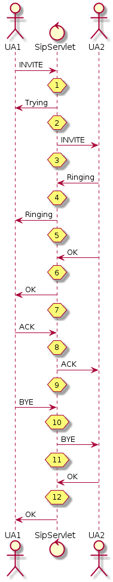

[[_ssfjcs_ss_for_jboss_clustering_support]]
= Understanding Restcomm  High Availabilty

.High Availability in Restcomm for JBoss AS7
[NOTE]
====
Clustering and Failover features as described below are not yet implemented in Restcomm for JBoss AS7.
This guide will be updated when the feature becomes available.
====

High Availability

Is a term used to describe software and hardware based strategies that are implemented to ensure optimal performance and continuous system operation in case of failure.
High availability encompasses, clustering, failover and load balancing

Clustering

Is a technique used to ensure continuous service availability by having two or more servers communicate with each other and share configuration and application data (replication) on  fixed, predetermined intervals.
This produces two or more application servers with identical setup.
There is often a primary server within a clustered cloud from which data is replicated to the secondary.
The application servers within a clustered environment will use what is called a heartbeat to ensure that all servers within are alive and functioning.
In the case of failure, another server (secondary) will take over the task of responding to client's requests without impacting user experience.
In some clustered ecosystem, load balancing is used as explained below.
 
Replication 

Replication is a simple clustered mode where cache instances automatically discover neighboring instances on other JVMs on the same local network, and form a cluster. 
Entries added to any of these cache instances will be replicated to all other cache instances in the cluster, and can be retrieved locally from any instance. 
This clustered mode provides a quick and easy way to share state across a cluster.

Replication can be synchronous or asynchronous. Use of either one of the options is application dependent. 
Synchronous replication blocks the caller (e.g. on a put() ) until the modifications have been replicated successfully to all nodes in a cluster. 
Asynchronous replication performs replication in the background (the put() returns immediately).

Asynchronous replication is faster (no caller blocking), because synchronous replication requires acknowledgments from all nodes in a cluster that they received and applied the modification successfully (round-trip time). 
However, when a synchronous replication returns successfully, the caller knows for sure that all modifications have been applied to all cache instances, whereas this is not be the case with asynchronous replication. 
With asynchronous replication, errors are simply written to a log. Even when using transactions, a transaction may succeed but replication may not succeed on all cache instances.

Replication strategy can be EarlyDialog or ConfirmDialog. EarlyDialog replication strategy is to replicate data when the dialog goes to EARLY state. 
In the figure, the EarlyDialog replication supports from step 5 to step 12. When 1xx response (except 100 Trying) with To tag is sent out (step 5), the sip application session, transaction and dialog will be replicated. 
There are a lot of overhead and the performance shall be decreased in term of EarlyDialog replication stratergy. 

ConfirmDialog replication strategy is to replicate data when the dialog goes to CONFIRM state (step 7 to step 12). When 200 OK is sent out (step 7), the sip application session, dialog and sip session will be replicated.

[.text-center]
.Figure 1

Load Balancing

This is ultimately about performance.
All request from clients  are evenly distributed by the (load balancer) to multiple application servers that are running similar configurations.This type of setup often includes fault tolerance or failover.
When one of the nodes, application server instance is not available, all traffic will be directed to the remaining servers.
This ensures continuity albeit performance can degrade.
Load balancing allows a single point of entry for multiple clients.

Failover

Failover is a way to provide continuous service to clients connecting to an application server in case of system, software or hardware failure.
Connections to an unresponsive server is directed (failed over) to a backup server.
This is often done within the scope of a clustered configuration aided by a load balancer.

It is important to note that clustering is also a way to provide failover and enhance server performance.
The same can be said of load balancing.
The idea behind all the above mentioned techniques is to provide high availability to connecting clients connecting to applications running on Restcomm .
In a nutshell, high availability englobes all the above mentioned techniques.

:leveloffset: 2

include::concept-section-SS_Load_Balancer.adoc[]

include::concept-section-SS_GracefulShutdown.adoc[]

:leveloffset: 1
