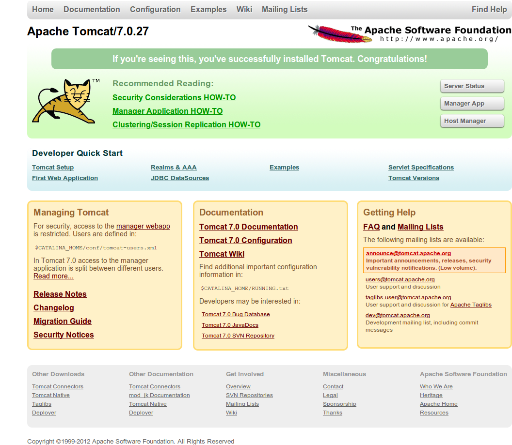
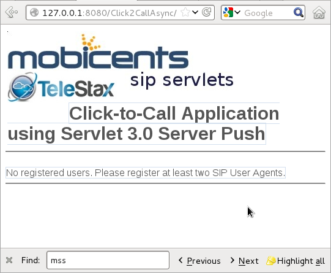
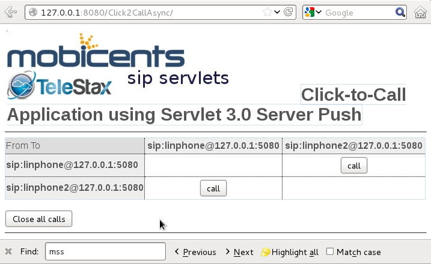

[[_getting_started_with_mss_tomcat_as7]]
= Getting Started with Restcomm SIP Servlets for Tomcat 7  

You can download the latest Restcomm SIP Servlets for Tomcat 7  link: https://code.google.com/p/sipservlets/wiki/Downloads?tm=2[Download Latest Version of  for Tomcat 7 ]

The content of the downloaded file can be extracted to any location you prefer on your computer.
The root directory to which the content of the download is extracted will be referred to as $CATALINA_HOME.
 

The content of the $CATALINA_HOME/bin is similar to the output below. 

----

bootstrap.jar                 cpappend.bat      startup.bat
catalina.bat                  daemon.sh         startup.sh
catalina.sh                   digest.bat        tomcat-juli.jar
catalina-tasks.xml            digest.sh         tomcat-native.tar.gz
commons-daemon.jar            setclasspath.bat  tool-wrapper.bat
commons-daemon-native.tar.gz  setclasspath.sh   tool-wrapper.sh
configtest.bat                shutdown.bat      version.bat
configtest.sh                 shutdown.sh       version.sh
----

You can start Restcomm SIP Servlets for Tomcat 7 by going to $CATALINA_HOME/bin directory and typing the following:  

----

sudo ./catalina.sh run
----

The startup process is slightly different from Restcomm SIP Servlets for JBoss AS7.
If you see an output like the one below, you know that Tomcat is correctly started.
This is a truncated log from the startup process. 

----

2012-08-21 22:23:41,025 INFO  [SipApplicationDispatcherImpl] (main) SipApplicationDispatcher Started
2012-08-21 22:23:41,025 INFO  [SipStandardService] (main) SIP Standard Service Started.
Aug 21, 2012 10:23:41 PM org.apache.catalina.startup.Catalina start
INFO: Server startup in 3608 ms
----

If you get an error message about environment variables or Java, make sure you have the CATALINA environment variables set.
 

link:Common_Content/Setting_the_JBOSS_HOME_Environment_Variable.adoc[Setting Environment Variables - JAVA and CATALINA]

== Testing Click2CallAsync with Restcomm  for Tomcat 7 

If Restcomm SIP Servlets for Tomcat 7 is started and running, you should be able to use your web browser to access the welcome page at this url `http\://127.0.0.1:8080/` This will show you a screenshot similar to the one below. 

.JBoss Application Server 7 Welcome Page

Deploying your application once the server is running is simple.
You need to copy your .War files to the  $CATALINA_HOME/webapps directory. 

There is a pre-installed sample SIP application that you can use to test your Restcomm SIP Servlets Tomcat 7 configuration.
The application is also located in the $CATALINA_HOME/webapps directory 

Start your web browser and go to the link, `http\://127.0.0.1:8080/Click2CallAsync/`

.Sample Application Name
[NOTE]
====
Note that the application name is case-sensitive and will not work if you try to access it as `http\://127.0.0.1:8080/click2callasync/`

====

The sample SIP application page will be similar to the screenshot below.
 

.SIP Sample Click2CallAsync Application

In order to use the application, you can download a softphone and start multiple instances of the phone on a single server.
In this guide, the softphone that will be used is Linphone.
The configuration is as follows: 

.Multiple Instances of Linphone
[NOTE]
====
On some Linux systems, you might need to use a different user profile in order to start a second instance of Linphone.
Ex.
sudo linphone 
====

----

(configuring two instances of Linphone)

start Linphone 
go to the Options menu

On the Network Settings tab, 
        SIP (UDP) port to 5061. (leave the rest as default)
On the Manage SIP Accounts tab, 
        click the add button
        Your SIP identity: = sip:linphone@127.0.0.1:5080
        SIP Proxy address: = sip 127.0.0.1:5080

Leave the rest of the settings as default.
        

Configuring Linphone (on the second shell)

go to the Options menu

On the Network Settings tab, 
        SIP (UDP) port to 5062. (leave the rest as default)
On the Manage SIP Accounts tab, 
        click the add button
        Your SIP identity: = sip:linphone2@127.0.0.1:5080
        SIP Proxy address: = sip 127.0.0.1:5080

Leave the rest of the settings as default.
----

Once the softphones are configured and are successfully registered with the Restcomm SIP Servlets for Tomcat 7 server, you will see a screenshot like the one below in the web browser at this url `http\://127.0.0.1:8080/Click2CallAsync/`

.SIP Click2CallAsync with Registers Clients

You can make calls using the application and the softphones you configured will start ringing.
It is important to start Restcomm SIP Servlets for Tomcat 7 in a terminal using the (./catalina.sh run) script.
It will help with troubleshooting SIP calls.
The logs you see on the terminal will let you know when a softphone registers with the Tomcat server and you will also be able to see the status of call setup and shutdown. 

.Stopping Restcomm SIP Servlets for Tomcat 7 
The best way to stop a server is using the CTRL-D on the terminal in which the server was started.
If you started the Restcomm SIP Servlets for Tomcat 7 server using the $CATALINA_HOME/bin/startup.sh, you can stop the server using $CATALINA_HOME/bin/shutdown.sh 

[[_bssswticar_sip_servlets_server_with_tomcat_installing_configuring_and_running]]
== Tomcat for Windows 

=== Installing the Restcomm SIP Servlets for Tomcat 7 Binary Distribution on Windows

. For this example, we'll assume that you downloaded the binary distribution zip file to the [path]_My Downloads_ folder.
  First, using Windows Explorer, create a subdirectory in [path]_My Downloads_ to extract the zip file's contents into.
  When you name this folder, it is good practice to include the version number; if you do so, remember to correctly match it with the version of the Restcomm SIP Servlets for Tomcat binary distribution you downloaded.
  In these instructions, we will refer to this folder as [path]_-tomcat-<version>_.
. Double-click the downloaded zip file, selecting as the destination folder the one you just created to hold the zip file's contents.
+
a. Alternatively, it is also possible to use Java's `jar -xvf` command to extract the binary distribution files from the zip archive.
  To use this method instead, first move the downloaded zip file from [path]_My Downloads_ to the folder that you just created to hold the SIP Servlets Server files.
b. Then, open the Windows Command Prompt and navigate to the folder holding the archive using the `cd` command.
+
.Opening the Command Prompt from Windows Explorer
[NOTE]
====
If you are using Windows Vista(R), you can open the Command Prompt directly from Explorer.
Hold down the kbd:[Shift] key and right-click on either a folder, the desktop, or inside a folder.
This will cause an  context menu item to appear, which can be used to open the Command Prompt with the current working directory set to either the folder you opened, or opened it from.
====

c. Finally, use the `jar -xvf` command to extract the archive contents into the current folder.
+
----
C:\Users\Me\My Downloads\-tomcat-<version>>jar -xvf ""
----

. At this point, you may want to move the folder holding the Restcomm SIP Servlets for Tomcat binary files (in this example, the folder named [path]_-tomcat-<version>_) to another location.
  This step is not strictly necessary, but it is probably a good idea to move the installation folder from [path]_My Downloads_ to a user-defined location for storing runnable programs.
  Any location will suffice, however.
. You may want to delete the zip file after extracting its contents in order to free disk space:
+
----
C:\Users\Me\My Downloads\-tomcat-<version>>delete ""
----

[[_bssswticar_binary_sip_servlets_server_with_tomcat_configuring]]
=== Configuring

Configuring Restcomm SIP Servlets for Tomcat consists in setting the [var]`CATALINA_HOME` environment variable and then, optionally, customizing your Restcomm SIP Servlets for Tomcat container by adding SIP Connectors, configuring the application router, and configuring logging.
See <<_bsssc_binary_sip_servlets_server_configuring>> to learn what and how to configure Restcomm SIP Servlets for Tomcat.

Alternatively, you can simply run your Restcomm SIP Servlets for Tomcat container now and return to this section to configure it later.

[[_bssswticar_binary_sip_servlets_server_with_tomcat_running]]
=== Running

Once installed, you can run the Tomcat Servlet Container by executing the one of the startup scripts in the [path]_bin_ directory (on Linux or Windows), or by double-clicking the [path]_run.bat_ executable batch file in that same directory (on Windows only). However, we suggest always starting Tomcat using the terminal or Command Prompt because you are then able to read--and act upon--any startup messages, and possibly debug any problems that may arise.
In the Linux terminal or Command Prompt, you will be able to tell that the container started successfully if the last line of output is similar to the following:

[source]
----
Using CATALINA_BASE:   /home/user/temp/apps/sip_servlets_server/
Using CATALINA_HOME:   /home/user/temp/apps/sip_servlets_server/
Using CATALINA_TMPDIR: /home/user/temp/apps/sip_servlets_server/temp
Using JRE_HOME:       /etc/java-config-2/current-system-vm
----

Detailed instructions are given below, arranged by platform.

.Procedure: Running Restcomm SIP Servlets for Tomcat on Windows
. There are several different ways to start the Tomcat Servlet Container on Windows.
  All of the following methods accomplish the same task.
+
Using Windows Explorer, change your folder to the one in which you unzipped the downloaded zip file, and then to the [path]_bin_ subdirectory.

. Although not the preferred way (see below), it is possible to start the Tomcat Servlet Container by double-clicking on the [path]_startup.bat_ executable batch file.
+
a. As mentioned above, the best way to start the Tomcat Servlet Container is by using the Command Prompt.
  Doing it this way will allow you to view all of the server startup details, which will enable you to easily determine whether any problems were encountered during the startup process.
  You can open the Command Prompt directly from the [path]_<topmost_directory>\bin_ folder in Windows Explorer, or you can open the Command Prompt via the [label]#Start# menu and navigate to the correct folder:
+
----
C:\Users\Me\My Downloads> cd "-tomcat-<version>"
----

b. Start the Tomcat Servlet Container by running the executable [path]_startup.bat_ batch file:
+
----
C:\Users\Me\My Downloads\-tomcat-<version>>bin\startup.bat
----

[[_bssswticar_binary_sip_servlets_server_with_tomcat_stopping]]
=== Stopping

Detailed instructions for stopping the Tomcat Servlet Container are given below, arranged by platform.
Note that if you properly stop the server, you will see the following three lines as the last output in the Linux terminal or Command Prompt (both running and stopping the Tomcat Servlet Container produces the same output):

----
Using CATALINA_BASE:   /home/user/temp/apps/sip_servlets_server
Using CATALINA_HOME:   /home/user/temp/apps/sip_servlets_server
Using CATALINA_TMPDIR: /home/user/temp/apps/sip_servlets_server/temp
Using JRE_HOME:       /etc/java-config-2/current-system-vm
----

.Procedure: Stopping Restcomm SIP Servlets for Tomcat on Windows
. Stopping the Tomcat Servlet Container on Windows consists in executing the [path]_shutdown.bat_ executable batch script in the [path]_bin_ subdirectory of the SIP Servlets-customized Tomcat binary distribution:
+
----
C:\Users\Me\My Downloads\-tomcat-<version>>bin\shutdown.bat
----
